# PatentIQ V2 Database Structure And Metric Maps

## Purpose

Provide two Mermaid diagrams:

1. overall PatentIQ V2 database structure
2. cross-layer metric lineage map

These diagrams are aligned with:
- [10-patentiq-v2-bronze-silver-gold-knowledge-tree.md](/Users/ardaerkan/Documents/MIGRATE/patent-iq/docs/next-phase-v2/10-patentiq-v2-bronze-silver-gold-knowledge-tree.md)
- [11-patentiq-v2-metric-lineage-catalog.md](/Users/ardaerkan/Documents/MIGRATE/patent-iq/docs/next-phase-v2/11-patentiq-v2-metric-lineage-catalog.md)

## 1. Database Structure

```mermaid
flowchart LR
  subgraph Bronze["Bronze Layer"]
    B1["bronze_patstat_appln<br/>tls201_appln"]
    B2["bronze_patstat_pat_publn<br/>tls211_pat_publn"]
    B3["bronze_patstat_citation<br/>tls212_citation"]
    B4["bronze_patstat_npl_publn<br/>tls214_npl_publn"]
    B5["bronze_patstat_docdb_fam_citn<br/>tls228_docdb_fam_citn"]
    B6["bronze_patstat_inpadoc_legal_event<br/>tls231_inpadoc_legal_event"]
    B7["bronze_patstat_appln_ipc<br/>tls209_appln_ipc"]
    B8["bronze_patstat_appln_cpc<br/>tls224_appln_cpc"]
    B9["bronze_patstat_person<br/>tls206_person"]
    B10["bronze_patstat_pers_appln<br/>tls207_pers_appln"]
    B11["bronze_ref_techn_field_ipc<br/>tls901_techn_field_ipc"]
    B12["bronze_ext_world_bank_gdp_ppp"]
    B13["bronze_ext_us_chamber_ip_index"]
    B14["bronze_ext_iso_country_map"]
    B15["bronze_ext_up_member_states"]
    B16["bronze_ext_kind_code_normalization_seed"]
    B17["bronze_ext_oecd_indicator_seed"]
    B17A["bronze_uspto_ft_document<br/>bronze_uspto_ft_biblio_application<br/>bronze_uspto_ft_claims<br/>bronze_uspto_ft_abstract"]
    B17B["bronze_epab_document<br/>bronze_epab_publication<br/>bronze_epab_application<br/>bronze_epab_claims<br/>bronze_epab_abstract"]
    B18["bronze_reg101_appln"]
    B19["bronze_reg107_parties"]
    B20["bronze_reg111_licensee"]
    B21["bronze_reg125_appeal"]
    B22["bronze_reg130_opponent"]
    B23["bronze_reg201_proc_step<br/>+ reg202 + reg203"]
    B24["bronze_reg301_event_data<br/>+ reg402_event_text"]
    B25["bronze_reg701_appln"]
    B26["bronze_reg731_event_data"]
    B27["bronze_reg741_appln_status<br/>+ reg742_event_text"]
  end

  subgraph Silver["Silver Layer"]
    S1["silver_family_core<br/>main-window + heritage flags"]
    S2["silver_family_member_publications"]
    S3["silver_assignee_harmonized"]
    S4["silver_kind_code_normalization"]
    S5["silver_tiered_market_weighting"]
    S6["silver_up_status"]
    S7["silver_family_jurisdiction_unrolled"]
    S8["silver_legal_status_event_ledger"]
    S9["silver_family_status_pt"]
    S10["silver_family_ipc_cpc_canonical"]
    S11["silver_family_wipo_fields"]
    S12["silver_family_citation_edges"]
    S13["silver_family_citation_edges_clean"]
    S14["silver_family_npl_backlinks"]
    S15["silver_family_citation_metrics"]
    S16["silver_enriched_citation_network"]
    S17["silver_global_tech_trends_timeseries"]
    S18["silver_local_tech_trends_timeseries"]
    S19["silver_family_coverage_metrics"]
    S20["silver_family_enforceability_branches"]
    S21["silver_family_oecd_quality"]
    S22["silver_grant_probability_forecast"]
    S23["silver_lapse_risk_forecast"]
    S24["silver_friction_risk_forecast"]
    S24A["silver_family_text_representative"]
    S25["silver_ep_register_core"]
    S26["silver_ep_register_agent_summary"]
    S27["silver_ep_register_current_opposition"]
    S28["silver_ep_register_up_status"]
    S29["silver_ep_register_proc_step_features"]
    S30["silver_ep_register_display_ledger"]
    S31["silver_ep_grant_probability_forecast"]
  end

  subgraph Gold["Gold Layer"]
    G1["gold_family_summary"]
    G1A["gold_family_heritage_summary"]
    G2["gold_family_blocking_power"]
    G3["gold_family_blocking_power_timeseries"]
    G4["gold_family_field_contributions_timeseries"]
    G5["gold_family_attacker_summary"]
    G6["gold_portfolio_field_timeseries"]
    G7["gold_portfolio_summary"]
    G7A["gold_portfolio_heritage_summary"]
    G8["gold_portfolio_threat_matrix"]
    G9["gold_family_forecast_summary"]
    G10["gold_portfolio_forecast_summary"]
    G11["gold_semantic_match_context"]
    G12["gold_family_ep_register_badges"]
    G13["gold_publication_ep_register_evidence"]
  end

  subgraph Sidecars["Sidecars"]
    V1["vec_family_embeddings"]
    M1["ml_model_registry"]
  end

  B1 --> S1
  B1 --> S2
  B2 --> S2
  B9 --> S3
  B10 --> S3
  B2 --> S4
  B16 --> S4
  B12 --> S5
  B13 --> S5
  B14 --> S5
  B2 --> S6
  B6 --> S6
  B15 --> S6
  S2 --> S7
  S6 --> S7
  B6 --> S8
  S4 --> S8
  S2 --> S8
  S6 --> S8
  S8 --> S9
  S7 --> S9
  B7 --> S10
  B8 --> S10
  S10 --> S11
  B11 --> S11
  B3 --> S12
  B5 --> S12
  S2 --> S12
  S12 --> S13
  S3 --> S13
  B3 --> S14
  B4 --> S14
  S2 --> S14
  S13 --> S15
  S14 --> S15
  S11 --> S15
  S1 --> S15
  S13 --> S16
  S3 --> S16
  S4 --> S16
  S5 --> S16
  B17A --> S24A
  B17B --> S24A
  B2 --> S24A
  B1 --> S24A
  B18 --> S25
  B1 --> S25
  S2 --> S25
  B19 --> S26
  S25 --> S26
  B22 --> S27
  B21 --> S27
  S25 --> S27
  B25 --> S28
  B26 --> S28
  B27 --> S28
  S25 --> S28
  B23 --> S29
  B24 --> S29
  S25 --> S29
  S27 --> S30
  S28 --> S30
  S29 --> S30
  S8 --> S30
  S11 --> S17
  S1 --> S17
  S11 --> S18
  S7 --> S18
  S1 --> S18
  S7 --> S19
  S9 --> S19
  S5 --> S19
  S9 --> S20
  S4 --> S20
  S5 --> S20
  S11 --> S20
  S18 --> S20
  S13 --> S21
  S14 --> S21
  S11 --> S21
  B17 --> S21
  S24A --> G11

  S1 --> G1
  S1 --> G1A
  S3 --> G1
  S3 --> G1A
  S9 --> G1
  S18 --> G1
  S11 --> G1
  S21 --> G1
  S15 --> G1A

  S20 --> G2
  S15 --> G2
  G2 --> G3
  S8 --> G3
  S20 --> G4
  S15 --> G4
  S11 --> G4
  S16 --> G5
  G4 --> G6
  S3 --> G6
  G2 --> G7
  G4 --> G7
  S21 --> G7
  G1A --> G7A
  S3 --> G7A
  S16 --> G8
  G2 --> G8
  S22 --> G9
  S23 --> G9
  S24 --> G9
  S31 --> G9
  G9 --> G10
  S24A --> V1
  V1 --> G11
  G1 --> G11
  G2 --> G11
  S9 --> G11
  S26 --> G12
  S27 --> G12
  S28 --> G12
  S25 --> G12
  S30 --> G13
  S27 --> G13
  S29 --> G13
  S28 --> G13
  M1 --> S22
  M1 --> S23
  M1 --> S24
  M1 --> S31
```

## 2. Metric Relation Map

```mermaid
flowchart TD
  A1["tls201_appln<br/>family anchor dates<br/>docdb_family_id"]
  A2["tls211_pat_publn<br/>jurisdiction<br/>kind_code"]
  A3["tls231_inpadoc_legal_event<br/>event ledger"]
  A4["tls209_appln_ipc + tls224_appln_cpc<br/>technical codes"]
  A5["tls212_citation + tls228_docdb_fam_citn<br/>patent citation edges"]
  A6["tls214_npl_publn + tls212_citation.cited_npl_publn_id<br/>backward NPL references"]
  A7["GDP PPP + IP Index + ISO map"]
  A8["WIPO techn field concordance"]
  A9["UP member states + kind code mapping"]
  A10["PATSTAT Register EP / UP procedural tables"]
  A11["USPTO full text + EPAB + PATSTAT abstracts<br/>semantic text hierarchy"]

  S1["silver_family_core<br/>family_earliest_priority_date<br/>family_priority_year<br/>is_main_window_family<br/>is_heritage_backfill_family"]
  S2["silver_kind_code_normalization<br/>branch_universal_stage<br/>branch_stage_multiplier"]
  S3["silver_tiered_market_weighting<br/>final_market_multiplier"]
  S4["silver_family_wipo_fields<br/>family_tech_breadth_wipo_count<br/>family_field_fraction"]
  S5["silver_legal_status_event_ledger"]
  S6["silver_family_status_pt<br/>family_composite_status<br/>family_has_any_active_grant"]
  S7["silver_family_citation_metrics<br/>family_forward_citations_clean<br/>family_forward_citations_weighted<br/>family_backward_npl_citation_count<br/>family_rcf_score<br/>family_science_grounding_score"]
  S8["silver_global_tech_trends_timeseries<br/>global_field_trend_coefficient"]
  S9["silver_local_tech_trends_timeseries<br/>local_field_trend_coefficient"]
  S10["silver_family_coverage_metrics<br/>family_raw_breadth_jurisdiction_count<br/>family_weighted_market_reach_score<br/>family_coverage_stability_score"]
  S11["silver_family_enforceability_branches<br/>branch_enforceability_contribution_raw"]
  S12["silver_family_oecd_quality<br/>family_generality_score<br/>family_originality_score<br/>family_radicalness_score<br/>family_science_grounding_score"]
  S13["silver_enriched_citation_network<br/>citation_lethality_score"]
  S14["silver_ep_register_display_ledger<br/>ep_display_status_text<br/>status_source_priority"]
  S15["silver_ep_register_proc_step_features<br/>ep_proc_step_maturity_score"]
  S16["silver_family_text_representative<br/>text_provenance<br/>is_abstract_fallback"]

  G1["gold_family_blocking_power<br/>family_market_threat_score_raw<br/>family_adjusted_citation_score_raw<br/>family_raw_absolute_blocking_power<br/>family_ui_blocking_power_score<br/>family_overall_legal_enforceability_score"]
  G2["gold_family_field_contributions_timeseries<br/>family_field_enforceability_contribution_score<br/>family_field_heritage_contribution_score"]
  G3["gold_family_attacker_summary<br/>family_top_attacker_score"]
  G4["gold_portfolio_field_timeseries<br/>portfolio_field_enforceability_score<br/>portfolio_field_heritage_score"]
  G5["gold_portfolio_summary<br/>portfolio_total_mass_score<br/>portfolio_hit_rate_top_decile<br/>portfolio_crown_jewel_index<br/>portfolio_opposition_rate"]
  G6["gold_publication_ep_register_evidence<br/>ep_display_status_text<br/>ep_opponent_names<br/>ep_register_lead_agent_name"]
  G7["silver_ep_grant_probability_forecast<br/>grant_probability_pct_ep_special"]
  G8["gold_semantic_match_context<br/>semantic_similarity_score<br/>chronology_scope<br/>text_provenance"]

  A1 --> S1
  A2 --> S2
  A7 --> S3
  A4 --> S4
  A8 --> S4
  A3 --> S5
  A9 --> S2
  A9 --> S10
  A10 --> S14
  A10 --> S15
  A11 --> S16
  A5 --> S7
  A6 --> S7
  A4 --> S7
  A1 --> S8
  A4 --> S8
  A1 --> S9
  A4 --> S9
  A2 --> S10
  A3 --> S10
  A6 --> S10
  S2 --> S11
  S3 --> S11
  S4 --> S11
  S6 --> S11
  S9 --> S11
  A5 --> S12
  A6 --> S12
  S4 --> S12
  S1 --> S12
  A5 --> S13
  S2 --> S13
  S3 --> S13
  S9 --> S13
  S15 --> G7
  S16 --> G8

  S11 --> G1
  S7 --> G1
  S11 --> G2
  S7 --> G2
  S4 --> G2
  S13 --> G3
  G2 --> G4
  G1 --> G5
  G2 --> G5
  S12 --> G5
  S14 --> G6
  G7 -. "EP-special forecast only; no direct BP effect" .-> G5
```

## 3. Reading Guide

The shortest path to understand the system is:

1. `family` anchor from `tls201_appln`
2. legal branch meaning from `tls211_pat_publn` + normalized kind codes
3. territorial value from GDP/IP market weighting
4. field allocation from IPC/CPC to WIPO mapping
5. citation impact from cleaned patent-family citation graph
6. science-grounding from backward NPL references as a separate quality layer
7. branch enforceability from stage x market x field x local trend
8. family blocking power from legal-market threat + adjusted patent citations
9. semantic text hierarchy from USPTO, EPAB, and PATSTAT fallback into family-level representative text
10. EP Register procedural overlays only at publication and family evidence surfaces
11. portfolio and field rankings from gold rollups
