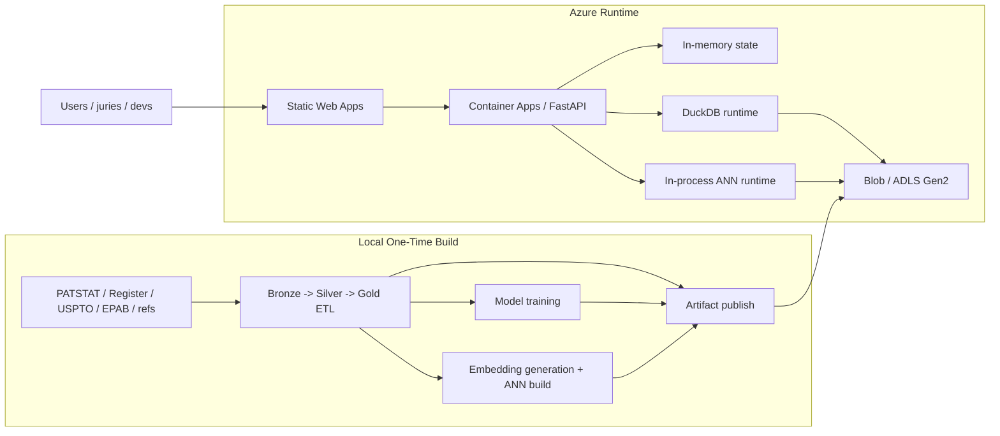

# PatentIQ V2 Azure Runtime And Storage Architecture

## Purpose

Define the agreed Azure architecture for the PatentIQ MVP based on the final design decisions reached during architecture ideation.

## Final Architecture Principles

1. ETL, training, and embedding generation run locally as one-time MVP build steps.
2. Azure hosts the product runtime and persistent artifacts.
3. Blob Storage or ADLS Gen2 is the persistent system of record for analytical artifacts.
4. DuckDB is the embedded analytics query engine inside the backend.
5. Semantic ANN/vector runtime runs in-process inside the backend for MVP.
6. App-state persistence is minimized; temporary user/session/worklist state stays in memory only.
7. Postgres and SQLite are omitted for the contest MVP unless later product requirements force them in.

## Recommended Azure Services

### Frontend

Use:
1. `Azure Static Web Apps Free`

Role:
1. serve the Next.js frontend,
2. keep hosting cost near zero,
3. provide a jury-friendly entry point.

### Backend

Use:
1. `Azure Container Apps Consumption`
2. `minReplicas = 0`

Role:
1. serve FastAPI,
2. load manifests and artifacts from Blob,
3. run DuckDB analytics queries,
4. run semantic retrieval in-process,
5. hold temporary in-memory state.

### Persistent Storage

Use:
1. `Azure Blob Storage` or `Azure Data Lake Storage Gen2`
2. `Hot + LRS` for active MVP data

Role:
1. persist Bronze, Silver, Gold Parquet,
2. persist model artifacts,
3. persist vector artifacts and ANN indexes,
4. persist manifests and release pointers,
5. persist Data Room catalogs, schemas, and wiki metadata,
6. optionally persist explicit export bundles where needed.

## Services Explicitly Avoided In MVP

1. Azure PostgreSQL as a required dependency
2. SQLite as durable shared state
3. Azure AI Search vector stack
4. AKS
5. always-on VMs
6. cloud ETL orchestration
7. cloud-first training pipelines

## Persistent Versus Ephemeral Split

### Persistent in Blob

1. `bronze/`
2. `silver/`
3. `gold/`
4. `models/`
5. `vectors/`
6. `manifests/`
7. `schemas/`
8. `wiki/`
9. `exports/approved-bundles/`

### Ephemeral in backend memory

1. current sessions
2. temporary worklists
3. recent searches
4. compare baskets
5. short-lived query cache
6. loaded manifests
7. loaded model metadata
8. loaded vector indexes

## Azure Data Flow



## DuckDB Role

DuckDB should run inside the backend as the analytical SQL engine.

It should:
1. read Parquet from Blob or mounted artifacts,
2. join Bronze/Silver/Gold-derived marts as needed,
3. power family, portfolio, comparison, and evidence views,
4. enrich semantic search hits with deterministic analytics.

DuckDB is not:
1. an ORM,
2. a durable multi-user metadata store,
3. a vector database.

## Semantic Runtime Role

The backend should include a lightweight in-process ANN/vector runtime for MVP.

It should:
1. load sampled `vector_claims` and `vector_abstract`,
2. load ANN indexes from Blob,
3. retrieve candidate family ids,
4. pass those candidates to DuckDB for enrichment.

## Semantic Text Selection Contract

Representative family text must be built offline using:

1. English EP granted `B` Claim 1 from EPAB,
2. else PATSTAT English abstract fallback.

This selection result is published to Blob as part of Silver and vector artifacts.

Current MVP consequence:
1. `vector_abstract` is the primary global semantic space,
2. `vector_claims` is narrower and EPAB-backed,
3. semantic serving must preserve provenance and fallback metadata.

## Blob Layout

```text
blob://patentiq-data/
  manifests/
    active_release.json
    active_models.json
    active_vectors.json
    data_catalog.json
  schemas/
  wiki/
  bronze/
  silver/
  gold/
  models/
  vectors/
  releases/
    mvp-2026-03-15/
      manifest.json
      pointers.json
  exports/
    approved-bundles/
```

## Data Room Integration

The Azure storage layout must support an in-app read-only Data Room.

That means:
1. maintain a single authoritative artifact store by default,
2. maintain catalog, schema, and wiki manifests in that same store,
3. allow backend-mediated read-only download links to approved artifacts,
4. create duplicated export bundles only when a separate handoff package is actually needed.

## Runtime Request Flow

### Standard analytics request

1. frontend calls backend,
2. backend resolves active manifests,
3. DuckDB reads the required Parquet artifacts,
4. backend returns family/portfolio/compare response.

### Semantic request

1. frontend calls semantic endpoint,
2. backend executes in-process ANN retrieval,
3. candidate family ids are produced,
4. DuckDB enriches candidates with legal status, chronology, and blocking-power context,
5. backend returns final semantically enriched result set.

## State Handling

The agreed MVP design is:

1. no durable user/session database,
2. no durable SQLite session store,
3. in-memory temporary state only.

Accepted consequence:

1. sessions/worklists/search history may disappear on restart or scale events,
2. this is acceptable for contest MVP use,
3. the app should present those states as temporary.

## Why Postgres Is Not Required

Postgres is intentionally omitted because:

1. the product does not require durable collaborative user state for MVP,
2. managed database cost would consume student credit inefficiently,
3. Blob + DuckDB + in-memory state is sufficient for the agreed scope.

## Release Contract

A release is valid only when:

1. local ETL build completed successfully,
2. models and vectors were published,
3. active manifests point to the correct release,
4. backend can load manifests and artifacts cleanly,
5. Data Room catalog points to approved read-only artifacts.

## Relationship To Other V2 Docs

This document operationalizes and aligns:

1. [19-patentiq-v2-storage-sizing-estimate.md](./19-patentiq-v2-storage-sizing-estimate.md)
2. [20-patentiq-v2-data-room-architecture-and-contract.md](./20-patentiq-v2-data-room-architecture-and-contract.md)
3. [14-patentiq-v2-metrics-generation-flow-and-guardrails.md](./14-patentiq-v2-metrics-generation-flow-and-guardrails.md)
4. [15-patentiq-v2-prediction-training-flow-and-guardrails.md](./15-patentiq-v2-prediction-training-flow-and-guardrails.md)
5. [16-patentiq-v2-semantic-search-and-comparison-flow-and-guardrails.md](./16-patentiq-v2-semantic-search-and-comparison-flow-and-guardrails.md)

## Final Recommendation

Use this exact MVP stack:

1. `Local ETL / training / embedding build`
2. `Azure Blob Storage or ADLS Gen2`
3. `Azure Static Web Apps Free`
4. `Azure Container Apps Consumption`
5. `DuckDB inside backend`
6. `In-process ANN runtime`
7. `In-memory temporary app state`

That is the agreed most cost-efficient, explainable, contest-appropriate PatentIQ architecture.
