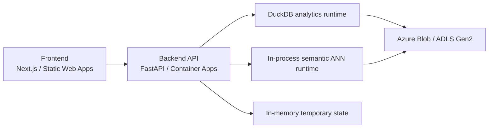

# PatentIQ V2 Backend And Frontend Application Architecture

## Purpose

Define the recommended backend and frontend architecture for the PatentIQ MVP based on the final runtime, storage, Data Room, and product-scope decisions.

This document answers:

1. how many deployable services should exist,
2. which internal modules should exist inside the backend,
3. which frontend workspaces and drill-down patterns should exist,
4. how publication-level views should fit under the family-first product model.

## Core Architectural Decision

PatentIQ MVP should use a:

`modular monolith`

That means:

1. one frontend application,
2. one backend application,
3. shared storage and artifacts,
4. multiple internal modules and services,
5. no microservice split unless later scale or team boundaries force it.

## Deployable Services

### Required deployables

For MVP, create only:

1. `frontend service`
2. `backend service`
3. `Azure Blob / ADLS artifact store`

### Explicitly not required as separate deployables

Do not create separate deployables for:

1. semantic retrieval,
2. forecasting,
3. Data Room,
4. publication evidence,
5. comparison,
6. sessions.

These should remain internal modules inside the backend.

## Final Runtime Diagram



## Backend Architecture

## Backend Style

Use:

1. thin API routers,
2. application services as orchestration units,
3. repositories/adapters for data access,
4. DuckDB as the analytical query engine,
5. infrastructure adapters for Blob, models, vectors, and in-memory state.

Avoid:

1. endpoint-specific business logic islands,
2. SQL embedded directly in route handlers,
3. one giant service file for everything,
4. premature microservice splits.

## Backend Module Boundaries

### API layer

Recommended route groups:

1. `families`
2. `publications`
3. `portfolios`
4. `market_intelligence`
5. `compare`
6. `forecasts`
7. `semantic`
8. `data_room`
9. `manifests`
10. `stats`

### Application services

Recommended internal service modules:

1. `family_service`
2. `publication_service`
3. `portfolio_service`
4. `market_intelligence_service`
5. `comparison_service`
6. `forecast_service`
7. `semantic_service`
8. `data_room_service`
9. `manifest_service`
10. `session_state_service`

### Infrastructure modules

Recommended infrastructure groupings:

1. `duckdb`
2. `blob`
3. `ml`
4. `vector`
5. `state`
6. `repositories`

## Publication-Level Logic

## Publication logic is required

Publication-level logic should exist because PatentIQ still needs:

1. member-publication drill-down,
2. office and kind-code evidence,
3. claims and abstract display,
4. legal / prosecution detail,
5. PATSTAT Register detail display,
6. provenance and source traceability.

## Publication logic should not become a separate deployable

Recommended rule:

1. `family` remains the default analytical scope,
2. `publication` remains the evidence and provenance scope,
3. publication support should be implemented as an internal backend module, not a separate cloud service.

## Backend Responsibility Split

### `family_service`

Owns:

1. family summary,
2. family blocking power,
3. family legal and citation components,
4. family member list,
5. family drill-down composition.

### `publication_service`

Owns:

1. member publication details,
2. claims/abstract/title retrieval,
3. kind-code and stage detail,
4. publication timeline rows,
5. EP Register / UP evidence display where applicable,
6. source provenance display.

### `portfolio_service`

Owns:

1. portfolio summary,
2. top families,
3. portfolio field and score rollups,
4. concentration and size-normalized views.

### `comparison_service`

Owns:

1. family-to-family compare,
2. portfolio-to-portfolio compare,
3. owner/family comparison views.

### `forecast_service`

Owns:

1. citation forecast serving,
2. grant / lapse / friction forecast serving,
3. portfolio forecast aggregation display.

### `semantic_service`

Owns:

1. semantic query handling,
2. vector-space selection,
3. ANN retrieval,
4. chronology/legal gating orchestration,
5. semantic result enrichment handoff to DuckDB.

### `data_room_service`

Owns:

1. Data Room overview,
2. dataset catalog,
3. schema previews,
4. methodology wiki content retrieval,
5. manifest retrieval,
6. approved download links.

### `manifest_service`

Owns:

1. active release pointer loading,
2. active model/vector manifest resolution,
3. release metadata checks.

### `session_state_service`

Owns:

1. temporary in-memory sessions,
2. worklists,
3. compare baskets,
4. recent searches,
5. TTL-based ephemeral state handling.

## Recommended Backend Folder Shape

```text
backend/
  main.py
  api/
    v1/
      families.py
      publications.py
      portfolios.py
      market_intelligence.py
      compare.py
      forecasts.py
      semantic.py
      data_room.py
      manifests.py
      stats.py
  application/
    services/
      family_service.py
      publication_service.py
      portfolio_service.py
      market_intelligence_service.py
      comparison_service.py
      forecast_service.py
      semantic_service.py
      data_room_service.py
      manifest_service.py
      session_state_service.py
  domain/
    models/
    schemas/
  infrastructure/
    duckdb/
    blob/
    ml/
    vector/
    state/
    repositories/
```

## Backend API Design Pattern

### Thin-router rule

Route handlers should:

1. validate request shape,
2. delegate to one application service,
3. translate domain/application errors into HTTP responses.

They should not:

1. build complex SQL,
2. manually compose large response graphs,
3. contain artifact-resolution logic.

### Service orchestration rule

Application services should:

1. orchestrate use cases,
2. coordinate DuckDB queries and infrastructure adapters,
3. return typed domain/application responses.

### Repository / adapter rule

Repositories and adapters should:

1. isolate storage and artifact access,
2. centralize query logic,
3. keep infrastructure-specific code out of services.

## Frontend Architecture

## Frontend Style

Use:

1. one Next.js app,
2. route-based workspaces,
3. feature-grouped components,
4. one typed API client layer,
5. shared UI primitives in `components/ui`.

Avoid:

1. a page tree that mirrors backend implementation details,
2. global dumping of every component into one folder,
3. treating publication evidence as a peer to family and portfolio at top navigation.

## Frontend Workspace Hierarchy

The recommended product drill-down hierarchy is:

`Portfolio -> Family -> Publication`

### Top-level workspaces

Recommended top-level workspaces:

1. `Portfolio`
2. `Lookup / Explore`
3. `Compare`
4. `Forecasts`
5. `Market Intelligence`
6. `Data Room`

### Market Intelligence is a top-level strategic workspace

`Market Intelligence` should be treated as a distinct strategic workspace because it answers a different question than a portfolio page:

1. `Portfolio` explains how one owner is positioned inside the mega-cluster,
2. `Market Intelligence` explains what is happening in the surrounding technology-market landscape itself,
3. portfolio pages may consume market-intelligence overlays, but must not replace the dedicated workspace.

### Publication is not a top-level analytical workspace

Publication UI should be:

1. a drill-down evidence view,
2. reachable from family pages, lookup results, semantic hits, and legal evidence paths,
3. clearly subordinate to family-first analytics.

## Recommended Frontend Folder Shape

```text
frontend/
  app/
    (dashboard)/
      portfolio/
      lookup/
      explore/
      compare/
      forecasts/
      market-intelligence/
      data-room/
      family/
      publication/
  components/
    ui/
    family/
    publication/
    portfolio/
    compare/
    forecasts/
    market-intelligence/
    semantic/
    data-room/
  lib/
    api/
    types/
    constants/
    formatters/
```

## Publication UI Pattern

### Family page responsibilities

The family page should show:

1. family summary and scores,
2. family members table,
3. legal and citation drill-downs,
4. links into publication evidence pages.

### Publication page responsibilities

The publication page should show:

1. bibliographic data,
2. office and kind-code details,
3. title / abstract / claim text,
4. legal / prosecution timeline,
5. Register evidence where applicable,
6. family linkage and provenance.

## Data Room UI Pattern

The Data Room should be a dedicated top-level workspace because it is:

1. a methodology/evidence room,
2. a dataset catalog,
3. a model and semantic transparency surface,
4. a contest differentiator.

Recommended Data Room sub-navigation:

1. `Overview`
2. `Sources`
3. `Pipeline`
4. `Datasets`
5. `Metrics`
6. `Models`
7. `Semantic`
8. `Manifests`

## API Consumption Pattern

The frontend should talk only to the backend BFF.

That means:

1. no direct Blob reads from the browser for product logic,
2. no direct DuckDB access from the frontend,
3. no direct ANN/vector-store calls from the frontend.

The backend should remain the single orchestration boundary.

## Why This Is The Cleanest MVP Pattern

This architecture fits the current PatentIQ constraints because it provides:

1. low deployment complexity,
2. low Azure cost,
3. strong code organization,
4. easy debugging,
5. family-first consistency,
6. clear publication-level drill-down support,
7. an explicit place for Data Room and semantic transparency.

## What To Avoid

Avoid these for MVP:

1. separate semantic microservice,
2. separate publication microservice,
3. separate Data Room backend,
4. direct frontend-to-storage architecture,
5. publication-first navigation model,
6. durable session infrastructure unless product requirements change.

## Relationship To Existing V2 Docs

This document aligns with:

1. [21-patentiq-v2-azure-runtime-and-storage-architecture.md](./21-patentiq-v2-azure-runtime-and-storage-architecture.md)
2. [20-patentiq-v2-data-room-architecture-and-contract.md](./20-patentiq-v2-data-room-architecture-and-contract.md)
3. [03-data-and-platform-workstreams.md](./03-data-and-platform-workstreams.md)
4. [04-product-and-ui-workstreams.md](./04-product-and-ui-workstreams.md)

## Final Recommendation

For PatentIQ MVP:

1. deploy one frontend and one backend,
2. keep the backend as a modular monolith,
3. implement publication support as an internal module,
4. keep family as the analytical default and publication as the evidence drill-down,
5. give Data Room first-class UI status,
6. keep the frontend organized by workspace and feature domain.
