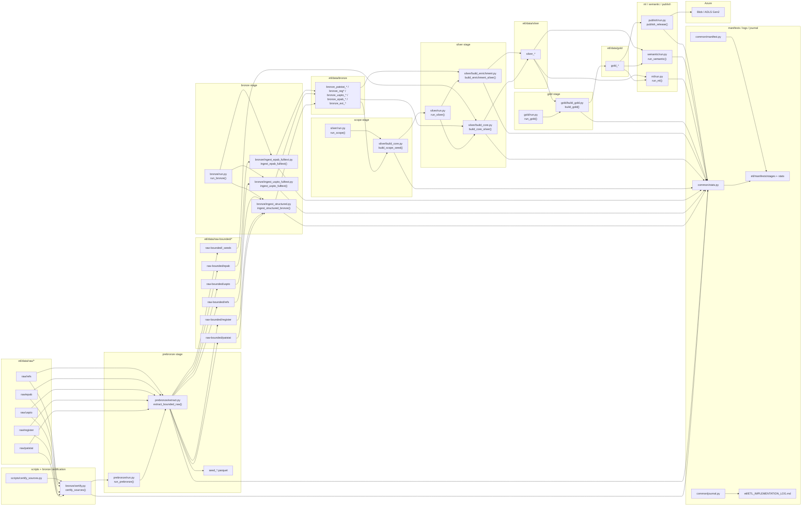
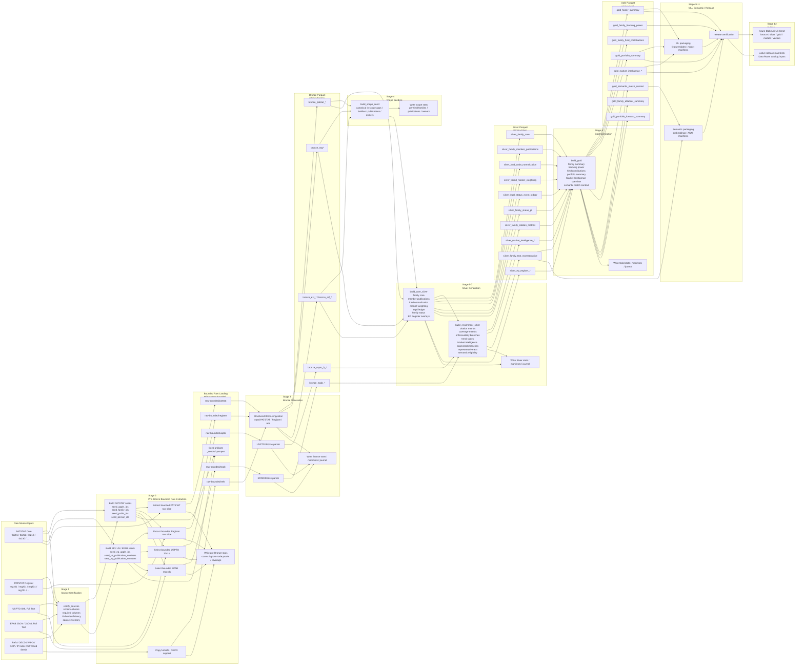

# PatentIQ V2 Local ETL And Artifact Build Runbook

## Purpose

Define the operational baseline for the one-time local PatentIQ MVP build so that:

1. raw sources are certified before transformation starts,
2. the 10-field mega-cluster scope is bounded early and deterministically,
3. Bronze, Silver, Gold, ML, and semantic artifacts are built in dependency-safe order,
4. every major stage has pre-checks, stop conditions, and downstream blast-radius rules,
5. the final Azure-hosted product receives a reproducible artifact release rather than ad hoc local exports.

This runbook is the implementation companion to:

1. [10-patentiq-v2-bronze-silver-gold-knowledge-tree.md](./10-patentiq-v2-bronze-silver-gold-knowledge-tree.md)
2. [14-patentiq-v2-metrics-generation-flow-and-guardrails.md](./14-patentiq-v2-metrics-generation-flow-and-guardrails.md)
3. [15-patentiq-v2-prediction-training-flow-and-guardrails.md](./15-patentiq-v2-prediction-training-flow-and-guardrails.md)
4. [16-patentiq-v2-semantic-search-and-comparison-flow-and-guardrails.md](./16-patentiq-v2-semantic-search-and-comparison-flow-and-guardrails.md)
5. [17-patentiq-v2-mega-cluster-scope-and-ghost-node-clarification.md](./17-patentiq-v2-mega-cluster-scope-and-ghost-node-clarification.md)
6. [21-patentiq-v2-azure-runtime-and-storage-architecture.md](./21-patentiq-v2-azure-runtime-and-storage-architecture.md)
7. [29-patentiq-v2-two-horizon-scope-and-heritage-backfill-policy.md](./29-patentiq-v2-two-horizon-scope-and-heritage-backfill-policy.md)

## Core Build Decision

PatentIQ MVP should use a:

`one-time local artifact build`

That means:

1. source ingestion, warehouse generation, model training, and vector generation run locally,
2. Azure is the serving and artifact-hosting target, not the heavy factory,
3. every stage writes deterministic outputs and manifests,
4. no recurring scheduler, CDC, or streaming layer is required for MVP.

## Canonical Build Objectives

The local ETL pipeline must guarantee:

1. the bounded family universe is correct before high-cost downstream calculations,
2. the family and portfolio universe is explicitly `mega_cluster_bounded`,
3. legal, citation, market, quality, and semantic layers all inherit the same scope and snapshot contract,
4. degraded inputs are surfaced before release rather than silently tolerated,
5. Data Room manifests can explain exactly what was built and what was omitted.

## Recommended ETL Repo Shape

Recommended top-level structure:

```text
etl/
  README.md
  pyproject.toml
  conf/
    build.yaml
    scope.yaml
    azure.yaml
    thresholds.yaml
  manifests/
    sources/
    stages/
    releases/
  scripts/
    run_full_build.py
    run_stage.py
    certify_sources.py
    publish_artifacts.py
  src/
    patentiq_etl/
      common/
      bronze/
      silver/
      gold/
      ml/
      semantic/
      publish/
  sql/
    bronze/
    silver/
    gold/
    checks/
  tests/
    test_source_certification.py
    test_scope_seed.py
    test_metric_invariants.py
    test_manifest_integrity.py
  data/
    raw/
    bronze/
    silver/
    gold/
    ml/
    vectors/
    releases/
    temp/
```

## Build Artifacts

The build should publish these artifact groups:

1. `bronze/` source-preserving Parquet
2. `silver/` normalized analytical Parquet
3. `gold/` product-facing marts
4. `ml/` feature tables, labels, model cards, calibration outputs, model artifacts
5. `vectors/` representative text, sampled embeddings, ANN indexes, vector manifests
6. `manifests/` source certification, stage certification, release pointers, row counts, checksums
7. `schemas/` dataset schema exports for the Data Room
8. `wiki/` methodology metadata pointers where generated programmatically

## Execution Model

The build should run through these stages:

1. source certification
2. pre-Bronze bounded raw extraction
3. optional heritage-backfill pre-Bronze extraction
4. raw chunk consolidation into canonical local bounded parquet
5. kind-code normalization seed completion from consolidated publication coverage
6. optional local USPTO ODP direct-Bronze stream extraction
7. Bronze ingestion
8. bounded-scope seeding
9. Silver core normalization
10. Silver legal, citation, market, and semantic preparation
11. Gold marts
12. ML feature and model build
13. semantic vector build
14. release certification
15. publish to Blob / ADLS

## Current Source Access Profile

The current intended MVP source-access split is:

1. `PATSTAT` -> `TIP PatstatClient`
2. `PATSTAT Register` -> `TIP PatstatClient`
3. `EPAB` -> `TIP EPABClient`
4. `USPTO` -> external local ODP worker by default
5. `refs` -> local staged reference files

That means:

1. source certification must validate a mix of TIP-backed and file-backed sources,
2. `prebronze` is the client-adapter stage that converts TIP queries into bounded parquet artifacts,
3. Bronze, Silver, and Gold remain artifact-driven after the bounded raw layer is written,
4. USPTO should be treated as an externalized ODP-fed source by default rather than a required TIP-local XML source,
5. for large local USPTO acquisition from ODP, the preferred operating model is `download ZIP -> temp XML -> direct Bronze parquet -> cleanup`, not long-lived bounded XML retention.

If the local USPTO ODP worker is used:

1. it should run after the bounded U.S. publication seed exists,
2. it should write direct `bronze_uspto_ft_*` parquet outputs,
3. the subsequent Bronze stage should treat those outputs as already materialized rather than reparsing bounded XML.

If the local USPTO ODP worker is not used or remains unavailable:
1. the build may still proceed with EPAB + PATSTAT semantic coverage,
2. semantic scope must be downgraded from broad claim-faithful search to discovery and comparison,
3. semantic manifests and Data Room pages must reflect that operating mode explicitly.

## TIP Capacity Constraint

When PatentIQ ETL runs inside TIP, the working constraint is approximately:

1. `4 CPU cores`
2. `32 GB RAM`
3. `30 GB local storage`

Under those limits, the full 10-field mega-cluster cannot be exported safely as
one monolithic local `prebronze` run.

The required execution model is:

1. TIP builds seeds and bounded chunks,
2. each chunk is uploaded to Azure Blob / ADLS immediately,
3. local chunk files are deleted after upload verification,
4. full bounded raw consolidation and heavy Bronze/Silver/Gold execution happen outside TIP.
5. the TIP seed query must apply the configured ETL year window before chunk extraction begins.
6. runtime chunk execution should stay conservative:
   - global chunk parallelism capped at `2` for the main horizon
   - family-level concurrency capped by `execution.max_workers`
   - Azure upload concurrency kept small with multipart tuning rather than broad upload fan-out
7. stage execution should emit live operational logs, not only end-of-stage manifests:
   - `etl/manifests/stages/pre-bronze-chunked-export.log`
   - `etl/manifests/stages/pre-bronze-chunked-export.events.jsonl`
8. chunked TIP `prebronze` should materialize the bounded global seed parquet set before chunk submission and reuse that seed set on rerun when it already exists
9. successful chunk manifests should still be the restart checkpoint boundary; seed reuse should not force already-successful chunks to rerun
10. downstream local ETL must not read the partitioned Blob chunk layout directly; it should first run `consolidate_before_bronze` to download staged main and heritage raw assets and rewrite them into canonical local bounded parquet files expected by Bronze

## Consolidation Policy Before Bronze

After TIP chunk export is complete, the local machine should run a dedicated
consolidation stage before `bronze`.

The stage contract is:

1. download staged raw assets from Azure Blob into a local import root,
2. pull main raw folders from `raw-bounded/`:
   - `patstat/`
   - `register/`
   - `epab/`
   - `refs/`
3. pull heritage raw folders from `raw-bounded-heritage/`:
   - `patstat/`
   - optional `_seeds/` for audit only
4. keep heritage seeds isolated from the active main seed directory,
5. recursively merge partitioned field/year chunk parquet into canonical local bounded parquet under:
   - `etl/data/raw-bounded/patstat/`
   - `etl/data/raw-bounded/register/`
   - `etl/data/raw-bounded/epab/`
   - `etl/data/raw-bounded/refs/`
6. merge heritage PATSTAT chunk outputs into the same canonical PATSTAT targets before Bronze,
7. drop synthetic Hive partition columns from staged chunk parquet before writing canonical outputs,
8. clear stale local EPAB extras before rewrite so Bronze only ingests the active EPAB file set,
9. leave `etl/data/raw-bounded/_seeds/` as the active main seed root for downstream stages.

The canonical stage name is:

- `python scripts/run_stage.py consolidate_before_bronze`
- alias: `python scripts/run_stage.py consolidate-before-bronze`

The EPAB semantic salvage stage should then run against the staged chunk parquet
before Bronze so the bounded EPAB files are rewritten into a deterministic
Bronze-compatible claim subset:

- `python scripts/run_stage.py repair_epab_for_semantic`
- alias: `python scripts/run_stage.py repair-epab-for-semantic`

Its responsibilities are:

1. select only EPAB chunk roots whose publication and claims row counts align exactly,
2. derive `publication_number_full` and synthetic `epab_doc_id` values from publication rows,
3. retain repaired claim-1 payloads for semantic use,
4. overwrite bounded EPAB publication/claims parquet in Bronze-compatible shape,
5. neutralize unreliable EPAB abstracts and leave PATSTAT abstracts as the universal fallback.

The kind-code completion stage should then run against the consolidated canonical
`tls211_pat_publn` table before Bronze:

- `python scripts/run_stage.py normalize_kind_code`
- alias: `python scripts/run_stage.py normalize-kind-code`

Its responsibilities are:

1. extract the observed `(publn_auth, publn_kind)` coverage from the canonical bounded publication table,
2. preserve any existing curated kind-code seed rows in `etl/data/raw/refs`,
3. fill missing observed pairs with deterministic EP-specific and prefix-based rules,
4. rewrite the canonical `kind_code_normalization.parquet` file consumed by Bronze,
5. emit a review queue for any remaining auto-generated or `OTHER` mappings before Bronze/Silver.

When only the kind-code curation seed changes after a prior successful Silver run, prefer the lighter downstream refresh path instead of a full Silver stage-group rerun:

- `python scripts/run_stage.py silver_kind_refresh`
- `python scripts/run_stage.py build_oecd_indicator_seed`
- `python scripts/run_stage.py build_oecd_indicator_cohort_stats`
- `python scripts/run_stage.py build_oecd_indicator_longform`
- `python scripts/run_stage.py build_oecd_indicator_bronze_projection`
- `python scripts/run_stage.py silver_oecd_refresh`
- alias: `python scripts/run_stage.py silver-kind-refresh`

This targeted refresh rebuilds:

1. `silver_kind_code_normalization` through `build_core_silver`,
2. kind-code-dependent citation weighting in `silver_enriched_citation_network` and `silver_family_citation_metrics`,
3. without rerunning Silver semantic payload generation.

Then run the incremental legal propagation step:

- `python scripts/run_stage.py silver_kind_legal_refresh`
- alias: `python scripts/run_stage.py silver-kind-legal-refresh`

This second step refreshes only:

1. `silver_family_enforceability_branches`,
2. `silver_family_field_contributions`,
3. `silver_family_oecd_quality`,
4. using the already refreshed citation/trend support outputs and only recomputing rows for families touched by manual kind-code overrides.

If the citation-weighted outputs are already current and only the legal-weighted marts still need propagation, you can skip the first step and run only `silver_kind_legal_refresh`.

If `silver_family_status_pt` was rebuilt after a legal-ledger date repair and the citation layer is still current, use the dedicated legal-status propagation step instead of the kind-code path:

- `python scripts/run_stage.py silver_legal_status_refresh`
- alias: `python scripts/run_stage.py silver-legal-status-refresh`

This refresh path:

1. rebuilds `silver_family_coverage_metrics` from the current `silver_family_status_pt`,
2. incrementally refreshes `silver_family_enforceability_branches`,
3. incrementally refreshes `silver_family_field_contributions`,
4. incrementally refreshes `silver_family_oecd_quality`,
5. using only families touched by dated lapse/expiry events in `silver_legal_status_event_ledger`.

If only the family-owner contract changed and the rest of Silver is already current, use the dedicated ownership refresh path:

- `python scripts/run_stage.py silver_owner_refresh`
- alias: `python scripts/run_stage.py silver-owner-refresh`

This refresh path:

1. rebuilds `silver_family_owner_bridge`,
2. rebuilds `silver_assignee_harmonized` as a deterministic primary-owner table,
3. preserves multi-owner family membership for downstream portfolio aggregation while keeping a single primary owner for family-facing display marts.

If the legal replay or yearly history sidecars need a dedicated rebuild, use the batched history path:

- `python scripts/run_stage.py silver_history_refresh`
- alias: `python scripts/run_stage.py silver-history-refresh`

This refresh path:

1. rebuilds `silver_branch_status_history` in deterministic family buckets,
2. expands `silver_branch_status_history_dense` from compact branch change-points into a dense yearly branch table,
3. rebuilds `silver_family_status_history` from branch replay deltas,
4. anchors the current-year `silver_family_status_history` row to `silver_family_status_pt` for exact current-snapshot parity,
5. avoids the monolithic full-corpus branch-year replay that is too expensive for the local DuckDB runtime ceiling.

## Current Semantic Build Policy

The current semantic MVP should assume:
1. EPAB is the active claim-text provider,
2. PATSTAT English abstract is the global fallback,
3. USPTO full text is optional and may be absent without blocking the overall ETL release,
4. claim-oriented semantic surfaces must be narrowed accordingly.

See the dedicated TIP full-scope operating note:

1. [28-patentiq-v2-tip-chunked-full-scope-execution-plan.md](./28-patentiq-v2-tip-chunked-full-scope-execution-plan.md)

## ETL Flow Diagrams

### Diagram 1: Product-Level Left-To-Right Flow

```mermaid
flowchart LR
    subgraph Raw["Raw Source Inputs"]
        PATSTAT["PATSTAT Core"]
        REGISTER["PATSTAT Register"]
        USPTO["USPTO Full Text XML"]
        EPAB["EPAB Full Text JSON/JSONL"]
        REFS["OECD / WIPO / GDP / IP Index / UP / Kind Seeds"]
    end

    subgraph Cert["1. Source Certification"]
        CERT["Validate files, schemas, required columns, 10-field sufficiency"]
    end

    subgraph PreBronze["2. Pre-Bronze Bounded Raw Extraction"]
        SEED["Build in-scope seeds<br/>applications / families / publications / persons"]
        EXPAND["Expand EP / US / EP anchors<br/>preserve ghost-node citation support"]
        BOUNDED["Write bounded raw slice<br/>raw-bounded/patstat / register / uspto / epab / refs / _seeds"]
    end

    subgraph Bronze["3. Bronze Generation"]
        BRONZE["Land typed, source-faithful Bronze parquet"]
    end

    subgraph Scope["4. Scope Seeding"]
        SCOPE["Build canonical in-scope analytical universe"]
    end

    subgraph Silver["5-7. Silver Generation"]
        SILVER["Normalize legal, citation, market, semantic, and register layers"]
    end

    subgraph Gold["8. Gold Generation"]
        GOLD["Build UI-facing marts<br/>family / portfolio / Market Intelligence / semantic context"]
    end

    subgraph Extra["9-11. ML, Semantic, Release Certification"]
        ML["ML artifacts"]
        SEM["Vector / ANN artifacts"]
        RCERT["Release certification"]
    end

    subgraph Azure["12. Publish To Azure"]
        BLOB["Azure Blob / ADLS Gen2<br/>bronze / silver / gold / models / vectors / manifests"]
    end

    PATSTAT --> CERT
    REGISTER --> CERT
    USPTO --> CERT
    EPAB --> CERT
    REFS --> CERT

    CERT --> SEED
    CERT --> EXPAND
    SEED --> BOUNDED
    EXPAND --> BOUNDED

    PATSTAT --> BOUNDED
    REGISTER --> BOUNDED
    USPTO --> BOUNDED
    EPAB --> BOUNDED
    REFS --> BOUNDED

    BOUNDED --> BRONZE
    BRONZE --> SCOPE
    SCOPE --> SILVER
    SILVER --> GOLD
    GOLD --> ML
    GOLD --> SEM
    ML --> RCERT
    SEM --> RCERT
    GOLD --> RCERT
    RCERT --> BLOB
```



### Diagram 2: Technical Script And Module Flow



### Diagram 3: Detailed Left-To-Right Warehouse Build Flow



## Stage 0: Build Configuration Freeze

### Goal

Freeze the build identity before reading data.

### Required frozen inputs

1. source snapshot paths
2. target scope definition for the 10 mega-cluster fields
3. year window
4. threshold configuration
5. method versions
6. output release id

### Outputs

1. `build_id`
2. `release_id`
3. `scope_manifest.json`
4. `threshold_manifest.json`

### Stop conditions

Stop if:

1. the selected 10-field scope is undefined,
2. the time window is inconsistent across configs,
3. method versions are missing,
4. release id is not unique.

### Downstream blast radius

If wrong here, every table, model, and Data Room artifact becomes non-reproducible.

## Stage 1: Source Certification

### Goal

Certify that the raw source inputs are present, parseable, and sufficient before Bronze generation begins.

In the current TIP-tailored ETL, this means:

1. `PATSTAT` and `Register` are certified through `TIP client + ORM model availability`,
2. `EPAB` is certified through `EPABClient` query availability,
3. `USPTO` and local refs are certified from staged files.

### Required source families

1. PATSTAT core
2. PATSTAT Register
3. USPTO full text
4. EPAB full text
5. OECD / WIPO / market reference inputs

### Common certification outputs

For each source family emit:

1. file inventory
2. snapshot date or version
3. row counts by source file or source table
4. schema signature
5. key null rates
6. parse errors
7. severity classification:
   - `fail_release`
   - `degrade_release`
   - `warn_only`

## Stage 1A: PATSTAT Core Certification

### Mandatory tables

1. `tls201_appln`
2. `tls202_appln_title`
3. `tls203_appln_abstr`
4. `tls204_appln_prior`
5. `tls206_person`
6. `tls207_pers_appln`
7. `tls209_appln_ipc`
8. `tls211_pat_publn`
9. `tls212_citation`
10. `tls214_npl_publn`
11. `tls224_appln_cpc`

### Mandatory pre-checks

1. `appln_id`, `pat_publn_id`, and `docdb_family_id` are populated at acceptable rates,
2. `tls211_pat_publn.appln_id` resolves back to `tls201_appln`,
3. publication kinds and dates parse cleanly,
4. citation rows bridge to publications at acceptable rates,
5. English title and abstract coverage is sufficient for the in-scope family universe,
6. `docdb_family_id` coverage is sufficient for family-first analytics,
7. the main `2007-2026` extraction window is present.

### Sufficiency checks for the 10 mega-cluster

Before downstream build, certify that the candidate PATSTAT universe can support all 10 selected fields:

1. every selected field has non-zero candidate applications,
2. every selected field has non-zero candidate families,
3. every selected field has non-zero candidate publications,
4. every selected field has non-zero owner links after `tls207_pers_appln`,
5. every selected field has non-zero citation coverage,
6. no selected field collapses to a trivial sample after time-window filtering.

### Severity

1. missing or badly corrupted PATSTAT core is `fail_release`,
2. weak abstract/title coverage is `degrade_release` for semantic and descriptive surfaces,
3. weak citation linkage is `degrade_release` for blocking power, OECD, and compare flows.

### Downstream blast radius

Impacts:

1. `silver_family_core`
2. `silver_family_member_publications`
3. all family and portfolio marts
4. all citation metrics
5. all forecast features
6. PATSTAT abstract fallback for semantic

## Stage 1B: PATSTAT Register Certification

### Mandatory pre-checks

1. EP application ids bridge back to PATSTAT application ids,
2. procedural step dates parse correctly,
3. opposition, appeal, and status tables are non-empty,
4. `is_latest` and status semantics are preserved,
5. EP coverage inside the in-scope universe is material enough to justify the overlay.

### Severity

1. missing Register is `degrade_release`, not `fail_release`,
2. EP-special legal and grant-probability overlays must be disabled if certification fails.

### Downstream blast radius

Impacts:

1. `silver_ep_register_core`
2. EP publication evidence views
3. EP-special grant model features
4. richer legal timeline drill-downs

## Stage 1C: USPTO Full-Text Certification

This stage is optional in the current semantic MVP.

### Mandatory pre-checks

1. XML parses cleanly,
2. publication identifiers and kind codes are recoverable,
3. abstract extraction is non-trivial,
4. claim extraction preserves order and claim ids,
5. `A` versus `B` kind parsing is reliable,
6. source publication identifiers bridge back to PATSTAT family-member publications.

### Severity

1. missing or low-quality USPTO parsing is `degrade_release`,
2. U.S. claim-space semantic priority must be disabled where bridge quality is too low.

### Downstream blast radius

Impacts:

1. `silver_family_text_representative`
2. `vector_claims`
3. any future U.S.-claim semantic workflow
4. semantic corpus provenance in the Data Room

## Stage 1D: EPAB Full-Text Certification

### Mandatory pre-checks

1. EPAB records parse cleanly,
2. `epab_doc_id` and publication/application identifiers are preserved,
3. English abstract and claim coverage is measurable,
4. claim ordering and language fields are intact,
5. EPAB publications bridge back to PATSTAT EP family-member publications.

### Severity

1. missing or weak EPAB is `degrade_release`,
2. EP claim-space semantic fallback must defer to PATSTAT abstract where EPAB is insufficient.

### Downstream blast radius

Impacts:

1. `silver_family_text_representative`
2. `vector_claims`
3. `vector_abstract`
4. EP semantic explainability surfaces

## Stage 1E: OECD / WIPO / Market Reference Certification

### Mandatory pre-checks

1. WIPO-field concordance resolves all intended field codes,
2. country maps are unique and complete for in-scope jurisdictions,
3. GDP / IP index tables have one row per jurisdiction-year,
4. OECD indicator seeds exist for the planned quality metrics,
5. kind-code normalization seeds cover all major offices used in scope.

### Severity

1. broken ISO and field concordances are `fail_release`,
2. weak OECD coverage is `degrade_release`,
3. weak market-weighting references are `degrade_release`.

### Downstream blast radius

Impacts:

1. `silver_family_wipo_fields`
2. `silver_tiered_market_weighting`
3. `silver_family_enforceability_branches`
4. OECD quality tables
5. market-intelligence marts

## Stage 2: Pre-Bronze Bounded Raw Extraction

### Goal

Produce the bounded raw PATSTAT, Register, USPTO, EPAB, and reference slice that Bronze will consume.

In the current TIP-tailored ETL, this stage is where:

1. `PatstatClient` materializes bounded PATSTAT and Register parquet extracts,
2. `EPABClient` materializes bounded EPAB result-group parquet extracts,
3. USPTO bulk XML files are filtered by the in-scope publication universe and, in TIP chunked mode, reduced to the same field/year publication chunk,
4. refs remain local-file copies.

### Rule set

1. derive the initial PATSTAT application seed from the selected 10 WIPO fields,
2. expand to bounded families, publications, persons, and EP legal anchors,
3. preserve ghost-node citation and NPL support rows,
4. copy reference/OECD support inputs in full,
5. keep the outputs raw-faithful and free of downstream scoring logic.

### Core outputs

1. bounded PATSTAT raw parquet slices under `etl/data/raw-bounded/patstat/`
2. bounded Register raw parquet slices under `etl/data/raw-bounded/register/`
3. bounded USPTO XML subset under `etl/data/raw-bounded/uspto/`
4. bounded EPAB parquet result groups under `etl/data/raw-bounded/epab/`
5. bounded reference/raw support parquet under `etl/data/raw-bounded/refs/`
6. bounded seed artifacts under `etl/data/raw-bounded/_seeds/`

### Stop conditions

Stop if:

1. the PATSTAT scope seed cannot represent all selected 10 fields,
2. bounded family or publication counts collapse unexpectedly,
3. citation ghost-node targets are dropped,
4. the bounded EP Register bridge cannot be formed for in-scope EP applications.

### Downstream blast radius

Wrong bounded raw extraction silently poisons Bronze and makes later failures much harder to localize.

## Stage 3: Bronze Ingestion

### Goal

Land typed, source-faithful Bronze Parquet without applying family-first business logic.

### Bronze rule set

1. preserve source identifiers,
2. preserve office-specific semantics,
3. parse dates and types cleanly,
4. do not collapse families,
5. do not score or rank,
6. do not let USPTO or EPAB override PATSTAT or Register metadata.

### Core Bronze outputs

1. PATSTAT Bronze tables
2. PATSTAT Register Bronze tables
3. USPTO Bronze full-text tables
4. EPAB Bronze full-text tables or TIP-derived EPAB parquet promotions
5. reference Bronze tables

### Stop conditions

Stop if:

1. primary keys duplicate materially,
2. bridge identifiers are lost,
3. row counts drift unexpectedly from source certification,
4. date parsing or type inference corrupts key fields.

### Downstream blast radius

Wrong Bronze corrupts the entire warehouse and invalidates all later validation.

## Stage 4: Bounded-Scope Seeding

### Goal

Establish the canonical in-scope family, application, and publication universe as early as possible after Bronze.

### Why this stage exists

The product is not a universal patent warehouse. It is a bounded 10-field mega-cluster system. Downstream analytics must therefore be confined to a deterministic in-scope universe before heavy calculations begin.

### Recommended seed outputs

1. `silver_scope_appln_seed`
2. `silver_scope_family_seed`
3. `silver_scope_publn_seed`
4. `silver_scope_owner_seed`

### Core logic

1. identify candidate applications that map into the selected 10 WIPO fields,
2. bridge those applications to `docdb_family_id`,
3. collapse to the canonical in-scope family set,
4. bridge those families back to application and publication ids,
5. carry scope metadata such as covered fields, window, and seed version.

### Mandatory pre-checks

1. each of the 10 fields contributes non-zero in-scope families,
2. family counts are plausible relative to application counts,
3. the scope seed is stable under rerun,
4. no out-of-scope family is promoted without explicit rule justification,
5. ghost-node logic is not applied yet to fabricate full family objects.

### Stop conditions

Stop if:

1. any selected field drops to zero,
2. scope collapse unexpectedly removes a material share of candidate families,
3. family-publication bridging is too weak for product views,
4. owner linkage becomes too sparse for portfolio analytics.

### Downstream blast radius

Impacts:

1. `silver_family_core`
2. all family and portfolio denominators
3. all field and market-intelligence marts
4. semantic sample eligibility
5. Data Room scope disclosures

## Stage 5: Silver Core Normalization

### Goal

Build the reusable family-first entity spine from the bounded scope seeds.

### Core outputs

1. `silver_family_core`
2. `silver_family_member_publications`
3. `silver_kind_code_normalization`
4. `silver_tiered_market_weighting`
5. `silver_up_status`
6. `silver_family_jurisdiction_unrolled`
7. `silver_legal_status_event_ledger`
8. `silver_family_status_pt`
8. `silver_family_ipc_cpc_canonical`
9. `silver_family_wipo_fields`
10. `silver_assignee_harmonized`

### Mandatory pre-checks

1. one row per family in `silver_family_core`,
2. publication bridge coverage remains sufficient for publication drill-down,
3. legal-event ledger preserves office-specific semantics before normalization loss,
4. field mapping coverage remains sufficient across all 10 selected fields,
5. owner harmonization coverage is sufficient for portfolio views.

### Downstream blast radius

Impacts:

1. all family pages
2. all portfolio pages
3. all legal and coverage marts
4. market-intelligence segmentation
5. forecast feature generation

## Stage 6: Silver Citation, Quality, And Market Layers

### Goal

Build the reusable analytical tables that power blocking power, market intelligence, OECD overlays, and compare flows.

### Core outputs

1. `silver_citation_edges_clean`
2. `silver_npl_backlinks`
3. `silver_family_citation_metrics`
4. `silver_enriched_citation_network`
5. `silver_family_trend_tables`
6. `silver_family_coverage_metrics`
7. `silver_family_enforceability_branches`
8. `silver_family_oecd_quality`
9. `silver_market_intelligence_segments`
10. `silver_market_intelligence_timeseries`

### Mandatory pre-checks

1. patent citations remain distinct from NPL,
2. ghost nodes are flagged and not promoted into full family analytics objects,
3. market weighting and local trend inputs are present before branch valuation,
4. no field in the 10-field scope has implausibly empty trend outputs,
5. OECD indicators are labeled as available, degraded, or unavailable by field and office where necessary.

### Downstream blast radius

Impacts:

1. `gold_family_blocking_power`
2. `gold_family_field_contributions`
3. `gold_portfolio_summary`
4. `gold_market_intelligence_overview`
5. compare workflows
6. forecast context features

## Stage 7: Silver Representative Text And Semantic Eligibility

### Goal

Build the deterministic representative text payload used for embeddings and semantic transparency.

### Core outputs

1. `silver_family_text_representative`
2. `silver_semantic_sampling_eligibility`

### Core text hierarchy

1. EP granted English `B` Claim 1 from EPAB
2. else PATSTAT English abstract fallback

### Mandatory pre-checks

1. A-document claims are excluded from claim-space payloads,
2. claim-order and language preservation are intact,
3. sanitization strips XML / HTML formatting and reference numerals safely,
4. `text_provenance` and `is_abstract_fallback` are emitted,
5. semantic eligibility is sampled only from the approved active-grant cohort.

### Downstream blast radius

Impacts:

1. `vector_claims`
2. `vector_abstract`
3. semantic discovery and compare
4. semantic overlap maps
5. Data Room semantic methodology disclosures

## Stage 8: Gold Marts

### Goal

Build the product-facing marts only after Silver passes validation.

### Core outputs

1. `gold_family_summary`
2. `gold_family_blocking_power`
3. `gold_family_blocking_power_timeseries`
4. `gold_family_field_contributions`
5. `gold_family_attacker_summary`
6. `gold_portfolio_summary`
7. `gold_portfolio_forecast_summary`
8. `gold_market_intelligence_overview`
9. `gold_market_intelligence_segments`
10. `gold_market_intelligence_timeseries`
11. `gold_semantic_match_context`

### Mandatory pre-checks

1. no Gold table recomputes upstream Silver logic opportunistically,
2. every Gold mart carries scope metadata where needed,
3. bounded portfolio semantics remain clearly labeled,
4. sampled semantic flags propagate into semantic-facing marts,
5. major page-level mart counts reconcile back to `silver_family_core`.

### Downstream blast radius

Impacts:

1. frontend page contracts
2. compare responses
3. export/report flows
4. Data Room dataset catalog

## Stage 9: ML Feature, Label, And Model Build

### Goal

Build leakage-safe predictive artifacts from validated Silver tables.

### Core outputs

1. label tables
2. feature tables
3. split registry
4. experiment registry
5. calibration registry
6. model registry
7. promoted model artifacts

### Mandatory pre-checks

1. training snapshot is frozen,
2. all upstream Silver dependencies passed validation,
3. label volumes are sufficient for each model scope,
4. feature leakage checks pass,
5. subgroup reliability checks pass before promotion.

### Downstream blast radius

Impacts:

1. family forecasts
2. portfolio forecast rollups
3. model cards in the Data Room

## Stage 10: Vector Build And ANN Packaging

### Goal

Build sampled embedding artifacts and ANN indexes for the MVP semantic layer.

### Core outputs

1. `vec_family_embeddings`
2. `vec_embedding_manifest`
3. ANN indexes for `vector_claims`
4. ANN indexes for `vector_abstract`

### Mandatory pre-checks

1. sampled family count matches approved semantic sample policy,
2. vector dimensions and model versions are stable,
3. provenance metadata is emitted,
4. claim and abstract spaces remain separate.

### Downstream blast radius

Impacts:

1. semantic retrieval runtime
2. semantic compare
3. Data Room semantic manifests

## Stage 11: Release Certification

### Goal

Decide whether the build is promotable to Azure.

### Required certification packs

1. source certification report
2. scope certification report
3. stage row-count report
4. schema diff report
5. metric invariant report
6. model promotion report
7. vector packaging report
8. release manifest

### Mandatory release checks

1. all 10 mega-cluster fields are represented in the in-scope family universe,
2. portfolio ownership coverage is sufficient for intended demo assignees,
3. legal-status coverage is sufficient for active family analytics,
4. publication coverage is sufficient for family drill-down,
5. market-intelligence segments are populated for all targeted fields,
6. forecast artifacts are present or explicitly disabled,
7. semantic artifacts are present or explicitly marked degraded,
8. Data Room catalog can enumerate every approved artifact.

### Release severity rules

1. `fail_release` blocks publish,
2. `degrade_release` permits publish only if the degraded surfaces are clearly labeled and excluded where unsafe,
3. `warn_only` is documented in the release manifest and Data Room.

## Stage 12: Publish To Azure

### Goal

Upload the certified release to the single authoritative artifact store.

### Publish outputs

1. `bronze/`
2. `silver/`
3. `gold/`
4. `models/`
5. `vectors/`
6. `manifests/`
7. `schemas/`
8. `wiki/`
9. optional `exports/approved-bundles/`

### Publish guardrails

1. no partial overwrite of an active release,
2. active pointers switch only after upload verification,
3. checksums and row counts are written alongside release manifests,
4. Data Room catalog points only to approved artifacts.

## Required Pre-Check Test Families

The ETL repo should include these test families at minimum:

### Source certification tests

1. source presence and schema tests
2. PATSTAT bridge integrity tests
3. Register bridge integrity tests
4. USPTO XML parse tests
5. EPAB claim/language parse tests
6. reference uniqueness tests

### Scope tests

1. 10-field presence test
2. in-scope family count sanity test
3. in-scope publication count sanity test
4. owner-linkage sufficiency test
5. ghost-node isolation test

### Metric invariant tests

1. one row per family where expected
2. no negative counts in coverage/citation tables
3. portfolio denominators use in-scope families only
4. `B`-level enforceability does not treat `A` records as granted rights
5. semantic claim-space never uses `A`-document claims

### Release integrity tests

1. manifest-to-file existence checks
2. schema export existence checks
3. Data Room catalog completeness checks
4. active pointer consistency checks

## Stage Runner Contract

Recommended commands:

```bash
python scripts/certify_sources.py
python scripts/run_stage.py consolidate_before_bronze
python scripts/run_stage.py repair_epab_for_semantic
python scripts/run_stage.py normalize_kind_code
python scripts/run_stage.py bronze
python scripts/run_stage.py scope
python scripts/run_stage.py silver
python scripts/run_stage.py gold
python scripts/run_stage.py ml
python scripts/run_stage.py semantic
python scripts/run_stage.py certify-release
python scripts/publish_artifacts.py
```

## Short Implementation Summary

Use this order and interpretation everywhere:

1. certify raw sources first,
2. land Bronze faithfully,
3. bound the in-scope family/application/publication universe early,
4. build Silver reusable logic from that bounded universe,
5. build Gold only from validated Silver,
6. build models and vectors only from certified upstream tables,
7. publish one approved release to the single authoritative Azure artifact store.
