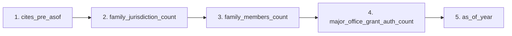

# Patent Citation Prediction Models

> **Technical Documentation — 3-Year & 5-Year Horizons**
>
> _Last updated: February 2026_

---

## 1. Purpose & Scope

This system predicts future **forward citation counts** of patents using structured, non-ML heuristic features derived from PATSTAT-based datasets. Two prediction horizons are supported:

| Model | Target | Primary Use |
|-------|--------|-------------|
| **3Y Model** | Citations within 3 years post `as_of_date` | Early signal, momentum detection |
| **5Y Model** | Citations within 5 years post `as_of_date` | Long-term impact & durability |

Predictions are accompanied by **calibrated uncertainty intervals**, enabling risk-aware decision making in UI and downstream analytics.

---

## 2. Temporal Definition (Leakage-Safe)

### As-Of Definition

```
as_of_date = filing_date + 2 years
```

- All **features** are computed strictly **before or at** `as_of_date`
- All **labels** are computed strictly **after** `as_of_date`

> [!IMPORTANT]
> This guarantees:
> - **Zero** future information leakage
> - Consistent comparability across filing cohorts
> - Full compatibility with real-time inference

---

## 3. Dataset Construction

**Base Table:** `ml_patent_training_table.parquet`

| Property | Value |
|----------|-------|
| Rows | ~1.08M patents |
| Families | ~1.01M |
| Leakage | 0 families leaking across splits |
| Splits | Time-aware (`train` / `val` / `test`) |

---

## 4. Targets (Labels)

### Raw Targets

| Target | Definition |
|--------|------------|
| `y_total_3y` | Total forward citations in `(as_of_date, as_of_date + 3 years]` |
| `y_total_5y` | Total forward citations in `(as_of_date, as_of_date + 5 years]` |

### Log-Transformed Targets

Used for regression stability:

```
y_log_total_3y = log(1 + y_total_3y)
y_log_total_5y = log(1 + y_total_5y)
```

---

## 5. Feature Set

> All features are **interpretable**, **stable**, and **non-textual**. Used identically in both models.

### Citation Signal

| Feature | Description |
|---------|-------------|
| `cites_pre_asof` | Forward citations observed before `as_of_date` |

### Family Strength & Reach

| Feature | Description |
|---------|-------------|
| `family_members_count` | Number of publications in family |
| `family_jurisdiction_count` | Number of jurisdictions covered |
| `family_cpc_subclass_count` | Technical breadth via CPC subclasses |

### Legal Solidity (Binary Flags)

| Feature | Description |
|---------|-------------|
| `has_us_grant` | Granted in USPTO |
| `has_cn_grant` | Granted in CNIPA |
| `has_jp_grant` | Granted in JPO |
| `has_kr_grant` | Granted in KIPO |
| `major_office_grant_auth_count` | Count of major offices granting |

### Temporal Context

| Feature | Description |
|---------|-------------|
| `as_of_year` | Filing cohort normalization |

---

## 6. Model Architecture

### Algorithm

- **LightGBM Regressor**
- **Objective:** L2 (RMSE) on log-citations
- **Rationale:**
  - Handles heavy-tailed distributions
  - Robust to sparse citation data
  - Fast inference & explainable

### Training Configuration (Shared)

```yaml
n_estimators:      2000
learning_rate:     0.03
num_leaves:        63
subsample:         0.8
colsample_bytree:  0.8
min_child_samples: 50
```

---

## 7. Model Performance

### 3-Year Model

| Metric | Validation | Test |
|--------|------------|------|
| RMSE (log) | 0.4335 | 0.4337 |
| Spearman (raw) | 0.2915 | 0.2913 |
| Precision@1% | 14.6% | 13.3% |

> [!NOTE]
> **Interpretation:** Strong ranking power in the top-impact patents. Very stable val/test parity indicates **no overfitting**. Suitable for early-signal UI & alerts.

### 5-Year Model

| Metric | Validation | Test |
|--------|------------|------|
| RMSE (log) | 0.5822 | 0.5825 |
| Spearman (raw) | 0.3115 | 0.3095 |
| Precision@1% | 13.0% | 12.8% |

> [!NOTE]
> **Interpretation:** Higher uncertainty is expected (longer horizon). Stronger ranking correlation than 3Y. Designed for **portfolio-level strategic analysis**.

---

## 8. Feature Importance

Top drivers (gain-based, 5Y example):



> [!TIP]
> **Key Insight:** Legal reach and family breadth dominate long-term impact — not short-term citations alone.

---

## 9. Uncertainty & Calibration

### Why Calibration Is Needed

- Raw model outputs are **point estimates**
- Citation data is **highly heteroskedastic**
- UI requires **confidence intervals**, not just scores

### Conformal Prediction (Absolute Log Error)

- Calibration performed on the **validation set**
- Target: `|y_log_true − y_log_pred|`
- Coverage target: **80%** (`α = 0.2`)

### Global Calibration

| Horizon | q̂ (log) | Empirical Coverage |
|---------|---------|-------------------|
| 3Y | 0.3855 | 79.9% |
| 5Y | 0.5542 | 79.8% |

### Difficulty-Aware Calibration (Bucketed)

Difficulty score = model-internal proxy of uncertainty _(e.g., prediction magnitude / feature dispersion)_.

**3Y Buckets:**

| Bucket | q̂ | Interpretation |
|--------|------|----------------|
| Easy | 0.17 | Stable, predictable patents |
| Medium | 0.30 | Moderate uncertainty |
| Hard | 0.47 | Highly uncertain / long-tail |

**5Y Buckets:**

| Bucket | q̂ | Interpretation |
|--------|------|----------------|
| Easy | 0.38 | Strong family signals |
| Medium | 0.49 | Mixed signals |
| Hard | 0.70 | Speculative, high variance |

### Final Interval Formula

```
ŷ_log ± q̂(bucket)
```

Converted back to raw citations via `exp(x) − 1`.

---


## 10. Deployment Artifacts

| Artifact | Format | Purpose |
|----------|--------|---------|
| `model_3y.txt` | LightGBM | Inference (3-year predictions) |
| `model_5y.txt` | LightGBM | Inference (5-year predictions) |
| `calibration.json` | JSON | Interval computation |
| Feature list | Code | Input validation |

> [!NOTE]
> All assets are **stateless**, **versionable**, and **HuggingFace-compatible**.
