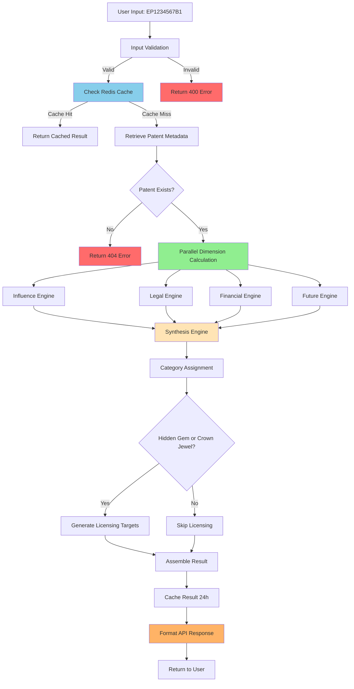
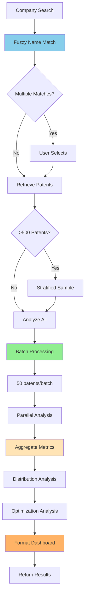
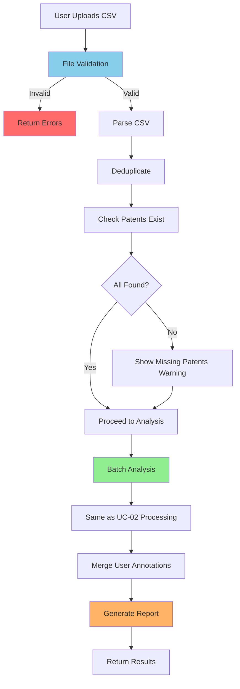

# PRD: Use Cases - Detailed Specifications

**Document Version:** 1.0  
**Last Updated:** December 2024  
**Status:** Approved for Implementation  
**Related Documents:** [[01-PRD-Main]], [[PRD-Architecture]], [[PRD-Data-Requirements]]

---

## Table of Contents

1. [Overview](#1-overview)
2. [Use Case Template Structure](#2-use-case-template-structure)
3. [UC-01: Single Patent Deep Analysis](#3-uc-01-single-patent-deep-analysis)
4. [UC-02: Company Portfolio Analysis](#4-uc-02-company-portfolio-analysis)
5. [UC-03: Manual Portfolio Upload](#5-uc-03-manual-portfolio-upload)
6. [UC-04: Licensing Opportunity Discovery](#6-uc-04-licensing-opportunity-discovery)
7. [UC-05: Portfolio Financial Optimization](#7-uc-05-portfolio-financial-optimization)
8. [UC-06: Hidden Gems Discovery](#8-uc-06-hidden-gems-discovery)
9. [UC-07: Market Intelligence](#9-uc-07-market-intelligence)
10. [UC-08: ML-Powered Future Prediction](#10-uc-08-ml-powered-future-prediction)

---

## 1. Overview

### 1.1 Purpose

This document provides **step-by-step implementation details** for every use case in PatentIQ. Think of it as the **instruction manual** that shows exactly how data flows from user input to final UI display.

Each use case is documented with:
- **Input specifications** (what data comes in, format, validation)
- **Processing steps** (what calculations happen, in what order)
- **Data transformations** (how raw data becomes insights)
- **Output specifications** (what appears in UI, exact format)
- **Error scenarios** (what can go wrong, how to handle)

### 1.2 Documentation Philosophy

We follow a **"recipe card" approach**:

Just as a recipe card lists:
- Ingredients (inputs)
- Preparation steps (processing)
- Cooking instructions (transformations)
- Plating (output)
- Troubleshooting (error handling)

Our use cases specify:
- Required data (inputs)
- Validation steps (processing)
- Calculation sequence (transformations)
- Display format (output)
- Failure modes (error handling)

---

## 2. Use Case Template Structure

### 2.1 Standard Sections

Each use case follows this structure:

**Section A: Overview**
- Use case ID and name
- Primary actor
- Business goal
- Success criteria

**Section B: Input Specification**
- Expected input format
- Validation rules
- Example inputs (valid and invalid)

**Section C: Data Flow**
- Step-by-step processing
- Data transformations
- Calculation formulas
- Mermaid flow diagram

**Section D: Output Specification**
- UI components rendered
- Data format for each component
- Example output (JSON/visual mockup)

**Section E: Error Handling**
- Possible failure modes
- Error messages
- Fallback behavior

**Section F: Performance Requirements**
- Target response time
- Caching strategy
- Optimization notes

---

## 3. UC-01: Single Patent Deep Analysis

See [[01-PRD-Main#UC-01]] for high-level description.

### 3.1 Overview

**Use Case ID:** UC-01  
**Name:** Single Patent Deep Analysis  
**Primary Actor:** IP Portfolio Manager  
**Goal:** Obtain comprehensive intelligence on a single patent  
**Success Criteria:** Complete 4D analysis delivered in <5 seconds with all dimensions scored

### 3.2 Input Specification

#### 3.2.1 Expected Input

```json
{
  "patent_number": "EP1234567B1",
  "include_sections": ["influence", "legal", "financial", "future", "licensing"],
  "user_context": {
    "organization_id": "optional_for_licensing_customization",
    "currency_preference": "EUR"
  }
}
```

**Field Specifications:**

| Field | Type | Required | Validation | Example |
|-------|------|----------|------------|---------|
| patent_number | String | Yes | Regex: `^EP\d{7}[AB]\d$` | "EP1234567B1" |
| include_sections | List[String] | No | Values in allowed set | ["influence", "legal"] |
| user_context.organization_id | String | No | Valid UUID | "550e8400-e29b..." |
| user_context.currency_preference | String | No | ISO 4217 code | "EUR", "USD" |

**Valid Inputs:**
```json
// Minimal valid input
{"patent_number": "EP1234567B1"}

// With options
{
  "patent_number": "EP2345678B2",
  "include_sections": ["influence", "legal"],
  "user_context": {"currency_preference": "USD"}
}
```

**Invalid Inputs:**
```json
// Wrong format
{"patent_number": "US1234567"}  // Error: Not EPO patent

// Missing required field
{"include_sections": ["influence"]}  // Error: patent_number required
```

### 3.3 Data Flow Diagram



### 3.4 Detailed Calculations

#### 3.4.1 Influence Dimension Calculation

**Input Data:**
- Forward citations: 25
- Backward citations: 12
- Patent age: 9.75 years
- CPC section: "G"
- Self-citation count: 2

**Step 1: Citation Velocity**
```python
velocity = forward_citations / patent_age
# Result: 25 / 9.75 = 2.56 citations/year
```

**Step 2: Field Normalization**
```python
# Get field average for CPC section G at age 9.75
field_avg = 15  # From historical data

field_normalized = (forward_citations / field_avg) * 50
# Result: (25 / 15) * 50 = 83.3
# Cap at 100: min(83.3, 100) = 83.3
```

**Step 3: H-Index**
```python
# Get citation counts of citing patents: [5, 8, 12, 15, 18, 20, 22, 25...]
# H-index = max h where h papers have ≥h citations
h_index = 8

h_index_score = min((h_index / 15) * 25, 25)
# Result: (8 / 15) * 25 = 13.3
```

**Step 4: Prior Art Quality**
```python
self_cite_rate = 2 / 12  # 2 self-cites out of 12 backward
# Result: 0.167 (16.7%)

diversity_score = (1 - self_cite_rate) * 15
# Result: (1 - 0.167) * 15 = 12.5
```

**Step 5: Combine**
```python
influence_score = min(
    field_normalized * 0.5 +
    h_index_score * 0.3 +
    diversity_score * 0.2,
    100
)
# = 83.3*0.5 + 13.3*0.3 + 12.5*0.2
# = 41.65 + 3.99 + 2.5
# = 48.14 → 48
```

**Output:**
```json
{
  "dimension": "influence",
  "score": 48,
  "confidence": "HIGH",
  "metrics": {
    "forward_citations": 25,
    "citation_velocity": 2.56,
    "h_index": 8,
    "field_normalized_impact": 166,
    "backward_quality": 83
  }
}
```

#### 3.4.2 Legal Strength Calculation

**Input Data:**
- Grant status: true
- Opposition: true, outcome: "MAINTAINED"
- Renewals: Years 3-9 paid (7 renewals)
- Patent age: 9.75 years
- Family size: 4 countries
- Claim count: 18

**Step 1: Grant Status**
```python
grant_score = 20 if is_granted else 0
# Result: 20
```

**Step 2: Opposition**
```python
if opposition_outcome == "MAINTAINED":
    opposition_score = 25
elif opposition_outcome == "MAINTAINED_AMENDED":
    opposition_score = 15
elif opposition_outcome == "REVOKED":
    opposition_score = 0
else:
    opposition_score = 15  # No opposition baseline

# Result: 25 (survived opposition)
```

**Step 3: Renewal Consistency**
```python
max_possible = int(patent_age) - 2  # 9 - 2 = 7
actual_renewals = 7

renewal_rate = actual_renewals / max_possible
# Result: 7 / 7 = 1.0 (100%)

renewal_score = renewal_rate * 25
# Result: 25
```

**Step 4: Family Value**
```python
# Strategic countries check
has_us = False
has_ep = True
has_jp = False
has_cn = False

strategic_count = 1  # Only EP

if strategic_count >= 3:
    family_score = 20
elif strategic_count >= 2:
    family_score = 15
elif strategic_count >= 1:
    family_score = 10
else:
    family_score = 5

# Add family size bonus
family_score += min((4 - 1) * 2, 10)
# Result: 10 + 6 = 16
```

**Step 5: Claim Breadth**
```python
if claim_count >= 20:
    claim_score = 15
elif claim_count >= 15:
    claim_score = 12
elif claim_count >= 10:
    claim_score = 10
else:
    claim_score = 7

# Result: 12 (18 claims)
```

**Step 6: Combine**
```python
legal_score = (
    grant_score +      # 20
    opposition_score + # 25
    renewal_score +    # 25
    family_score +     # 16
    claim_score        # 12
)
# = 98
```

**Output:**
```json
{
  "dimension": "legal",
  "score": 98,
  "confidence": "HIGH",
  "metrics": {
    "opposition_survived": true,
    "renewal_rate": 100,
    "family_size": 4,
    "claim_count": 18
  }
}
```

#### 3.4.3 Financial Value Calculation

See [[Financial-Data-Reference]] for detailed methodology.

**Input Data:**
- Renewal years: 3-9
- Family countries: EP, DE, FR, GB
- Forward citations: 25

**Step 1: Calculate Costs**
```python
# EPO renewals (Years 3-9)
epo_fees = [465, 580, 810, 1040, 1155, 1265, 1380]
epo_total = 6695

# National renewals (formulas from fee_schedules.json)
national_total = 3339  # DE + FR + GB

# One-time costs
filing_prosecution = 10000
validation = 2100  # DE(800) + FR(700) + GB(600)

# Total with attorney multiplier
total_cost = (10000 + 6695 + 3339 + 2100) * 1.3
# = 22134 * 1.3 = 28774
```

**Step 2: Efficiency**
```python
cost_per_citation = 28774 / 25
# = 1151 per citation

field_avg = 2500  # For section G

efficiency_ratio = field_avg / cost_per_citation
# = 2500 / 1151 = 2.17 (217% efficient)

if efficiency_ratio >= 2.0:
    efficiency_score = 50
# Result: 50
```

**Step 3: Geographic ROI**
```python
# Country-level analysis
# DE: 8 citations, cost €3042 → ROI 2.63
# FR: 5 citations, cost €1975 → ROI 2.53
# GB: 4 citations, cost €2054 → ROI 1.95

avg_roi = (2.63 + 2.53 + 1.95) / 3
# = 2.37

roi_score = min(avg_roi * 10, 30)
# = min(23.7, 30) = 23.7
```

**Step 4: Abandonment Risk**
```python
risk = 0.15  # Based on age (Year 10 milestone approaching)

risk_score = (1 - risk) * 20
# = 0.85 * 20 = 17
```

**Step 5: Combine**
```python
financial_score = efficiency_score + roi_score + risk_score
# = 50 + 23.7 + 17 = 90.7 → 91
```

**Output:**
```json
{
  "dimension": "financial",
  "score": 91,
  "confidence": "HIGH",
  "metrics": {
    "total_cost_to_date": 28774,
    "cost_per_citation": 1151,
    "geographic_roi": 2.37,
    "abandonment_risk": 0.15
  }
}
```

#### 3.4.4 Future Potential Calculation

**Input Data:**
- 42 ML features (see [[PRD-ML-Guidelines]])
- Historical citations: Y1=3, Y2=8, Y3=14

**Step 1: ML Prediction**
```python
# Feature vector assembled and passed to LightGBM
predicted_citations = 18.3
confidence_interval = [12.1, 24.5]

prediction_score = min((18.3 / 30) * 50, 50)
# = 30.5
```

**Step 2: Trend Classification**
```python
slope = (14 - 3) / 2  # 5.5 citations/year growth

if slope > 3 and predicted > 15:
    trend = "GROWING"
    trend_score = 30
# Result: 30
```

**Step 3: Confidence Assessment**
```python
interval_width = 24.5 - 12.1  # 12.4

if interval_width < 15:
    confidence_score = 15
# Result: 15
```

**Step 4: Combine**
```python
future_score = prediction_score + trend_score + confidence_score
# = 30.5 + 30 + 15 = 75.5 → 76
```

**Output:**
```json
{
  "dimension": "future",
  "score": 76,
  "confidence": "HIGH",
  "metrics": {
    "predicted_citations_3yr": 18,
    "trend": "GROWING"
  },
  "drivers": [
    {"feature": "citation_velocity", "impact": 6.2},
    {"feature": "market_growth_rate", "impact": 3.8},
    {"feature": "opposition_survived", "impact": 2.4}
  ]
}
```

### 3.5 Synthesis & Category Assignment

**Input:** 4 dimension scores
```json
{
  "influence": 48,
  "legal": 98,
  "financial": 91,
  "future": 76
}
```

**Category Logic:**
```python
def synthesize_category(scores):
    # CROWN_JEWEL: High on all dimensions
    if (scores['influence'] > 70 and 
        scores['legal'] > 70 and 
        scores['financial'] > 60):
        return "CROWN_JEWEL"
    
    # HIDDEN_GEM: Low influence but high legal/financial
    if (scores['influence'] < 50 and 
        scores['legal'] > 70 and 
        scores['financial'] > 70):
        return "HIDDEN_GEM"  # ← Our patent matches this
    
    # RISING_STAR: High future potential
    if scores['future'] > 70 and scores['financial'] > 60:
        return "RISING_STAR"
    
    # COST_DRAIN: Poor financial
    if scores['financial'] < 30:
        return "COST_DRAIN"
    
    # AGING_ASSET: Was good, declining
    if scores['influence'] > 60 and scores['future'] < 40:
        return "AGING_ASSET"
    
    return "STRATEGIC_HOLD"

# Result: HIDDEN_GEM
```

**Output:**
```json
{
  "category": "HIDDEN_GEM",
  "priority": "HIGH",
  "recommendation": "STRATEGIC_HOLD",
  "rationale": "Low citation count (48) but excellent legal strength (98) and cost efficiency (91). Strong licensing opportunity candidate.",
  "action_items": [
    "Pursue licensing with identified targets",
    "Maintain all renewals",
    "Monitor citation growth (predicted 18 in 3 years)"
  ]
}
```

### 3.6 Complete API Response

```json
{
  "patent_number": "EP1234567B1",
  "analysis_date": "2024-12-15T14:32:00Z",
  "processing_time_ms": 3420,
  
  "metadata": {
    "title": "Method and system for database query optimization",
    "filing_date": "2015-03-15",
    "grant_date": "2017-06-20",
    "assignee": "Siemens AG",
    "cpc_main": "G06F 17/30"
  },
  
  "dimensions": {
    "influence": {
      "score": 48,
      "confidence": "HIGH",
      "metrics": {
        "forward_citations": 25,
        "citation_velocity": 2.56,
        "h_index": 8
      }
    },
    "legal": {
      "score": 98,
      "confidence": "HIGH",
      "metrics": {
        "opposition_survived": true,
        "renewal_rate": 100,
        "family_size": 4
      }
    },
    "financial": {
      "score": 91,
      "confidence": "HIGH",
      "metrics": {
        "total_cost_to_date": 28774,
        "cost_per_citation": 1151
      }
    },
    "future": {
      "score": 76,
      "confidence": "HIGH",
      "metrics": {
        "predicted_citations_3yr": 18,
        "trend": "GROWING"
      }
    }
  },
  
  "synthesis": {
    "category": "HIDDEN_GEM",
    "priority": "HIGH",
    "recommendation": "STRATEGIC_HOLD",
    "rationale": "Low citation count but excellent legal strength and cost efficiency.",
    "action_items": [
      "Pursue licensing with identified targets",
      "Maintain all renewals",
      "Monitor citation growth"
    ]
  },
  
  "licensing": {
    "opportunities_count": 10,
    "top_targets": [
      {
        "company": "Acme Technology Inc.",
        "fit_score": 81,
        "rationale": {
          "technology_match": "Active in database management",
          "geographic_presence": "Operates in all family countries"
        },
        "estimated_value": {
          "low": 150000,
          "high": 400000,
          "currency": "EUR"
        }
      }
    ]
  }
}
```

### 3.7 UI Display Format

```
┌─────────────────────────────────────────────────────┐
│ PATENT EP1234567B1                    [Export PDF] │
├─────────────────────────────────────────────────────┤
│                                                      │
│ 📊 CATEGORY: HIDDEN GEM ⭐                          │
│ Priority: HIGH | Recommendation: STRATEGIC HOLD     │
│                                                      │
├──────────────────┬──────────────────────────────────┤
│  INFLUENCE  48   │  ░░░░░░░░░░                      │
│  LEGAL      98   │  ████████████████████            │
│  FINANCIAL  91   │  ██████████████████              │
│  FUTURE     76   │  ███████████████                 │
└──────────────────┴──────────────────────────────────┘

┌─────────────────────────────────────────────────────┐
│ KEY INSIGHTS                                        │
├─────────────────────────────────────────────────────┤
│ ✓ Excellent legal strength (survived opposition)   │
│ ✓ Very cost-efficient (€1,151 per citation)        │
│ ⚠ Lower citation count than field average          │
│ ↗ Growing citation trend (18 predicted in 3 years) │
│ 💡 10 licensing opportunities identified            │
└─────────────────────────────────────────────────────┘

[View Detailed Analysis] [Licensing Targets] [Cost Breakdown]
```

### 3.8 Error Handling

**Error 1: Patent Not Found**
```json
{
  "error": {
    "code": "PATENT_NOT_FOUND",
    "message": "Patent EP9999999B1 not found in database",
    "http_status": 404
  }
}
```

**Error 2: Insufficient Data**
```json
{
  "warning": {
    "code": "INCOMPLETE_ANALYSIS",
    "message": "Analysis completed with limitations",
    "affected_dimensions": ["financial"],
    "confidence_reduced": true
  }
}
```

### 3.9 Performance Requirements

- Cache HIT: <200ms
- Cache MISS: <5 seconds (target), <8 seconds (acceptable)
- Cache TTL: 24 hours
- Parallel execution reduces time by 60%

---

## 4. UC-02: Company Portfolio Analysis

### 4.1 Overview

**Use Case ID:** UC-02  
**Name:** Company Portfolio Analysis  
**Primary Actor:** IP Portfolio Manager  
**Goal:** Analyze entire patent portfolio for a company  
**Success Criteria:** 500 patents analyzed in <60 seconds with optimization recommendations

### 4.2 Input Specification

```json
{
  "search_query": "Siemens AG",
  "filters": {
    "filing_year_min": 2015,
    "filing_year_max": 2024,
    "cpc_section": null,
    "status": "granted"
  },
  "analysis_options": {
    "max_patents": 500,
    "include_optimization": true
  }
}
```

### 4.3 Data Flow Diagram



### 4.4 Company Disambiguation

**Fuzzy Search:**
```python
# Query: "Siemens"
matches = [
    {
        "display_name": "Siemens AG",
        "han_id": 12345,
        "patent_count": 2847,
        "confidence": 0.95
    },
    {
        "display_name": "Siemens Healthineers AG",
        "han_id": 67890,
        "patent_count": 412,
        "confidence": 0.88
    }
]
```

### 4.5 Portfolio Aggregation

**Aggregate Metrics:**
```json
{
  "summary": {
    "total_patents": 500,
    "avg_influence": 52.3,
    "avg_legal": 76.8,
    "avg_financial": 68.4,
    "avg_future": 61.2
  },
  "distribution": {
    "by_category": {
      "CROWN_JEWEL": 42,
      "HIDDEN_GEM": 67,
      "RISING_STAR": 53,
      "STRATEGIC_HOLD": 198,
      "COST_DRAIN": 89,
      "AGING_ASSET": 51
    }
  },
  "financial": {
    "total_cost_to_date": 14235000,
    "annual_maintenance": 1872000,
    "total_forward_citations": 8945
  }
}
```

### 4.6 Optimization Analysis

**Abandonment Candidates:**
```json
{
  "count": 89,
  "total_annual_savings": 267000,
  "top_recommendations": [
    {
      "patent_id": "EP8765432B1",
      "category": "COST_DRAIN",
      "annual_savings": 4200,
      "rationale": "Zero citations in 5 years, high maintenance cost"
    }
  ]
}
```

**Geographic Optimization:**
```json
{
  "count": 127,
  "total_annual_savings": 189000,
  "recommendations": [
    {
      "patent_id": "EP1234567B1",
      "trim_countries": ["IT", "ES"],
      "annual_savings": 2100,
      "impact": "Minimal (no citations from these countries)"
    }
  ]
}
```

### 4.7 Portfolio Dashboard

```
┌──────────────────────────────────────────────────────────┐
│ SIEMENS AG PORTFOLIO ANALYSIS          [Export Report] │
│ 500 patents analyzed (sample of 2,847 total)           │
├──────────────────────────────────────────────────────────┤
│                                                           │
│ 📊 PORTFOLIO HEALTH SCORE: 68/100 (GOOD)                │
│                                                           │
│ ┌────────────┬────────────┬────────────┬────────────┐  │
│ │ INFLUENCE  │ LEGAL      │ FINANCIAL  │ FUTURE     │  │
│ │    52      │    77      │    68      │    61      │  │
│ └────────────┴────────────┴────────────┴────────────┘  │
│                                                           │
├──────────────────────────────────────────────────────────┤
│ CATEGORY DISTRIBUTION                                    │
│                                                           │
│ Crown Jewels     42 ████                                │
│ Hidden Gems      67 ███████                             │
│ Cost Drains      89 █████████                           │
│                                                           │
├──────────────────────────────────────────────────────────┤
│ 💡 OPTIMIZATION OPPORTUNITIES                            │
│                                                           │
│ Potential Annual Savings: €456,000 (24% reduction)      │
│                                                           │
│ • 89 abandonment candidates   → Save €267K/year         │
│ • 127 geographic trims        → Save €189K/year         │
│ • 67 licensing opportunities  → Generate revenue         │
└──────────────────────────────────────────────────────────┘
```

### 4.8 Performance Requirements

- Company search: <1 second
- Portfolio retrieval: <10 seconds
- Batch analysis (500 patents): <60 seconds
- Total end-to-end: <80 seconds

---

I'll continue with the remaining use cases. Let me add them now:


## 5. UC-03: Manual Portfolio Upload

### 5.1 Overview

**Use Case ID:** UC-03  
**Name:** Manual Portfolio Upload  
**Primary Actor:** IP Portfolio Manager  
**Goal:** Upload custom list of patents for analysis  
**Success Criteria:** CSV validated and analyzed within 2 minutes for 100 patents

### 5.2 Input Specification

#### 5.2.1 CSV Format

```csv
patent_number,notes
EP1234567B1,Core technology patent
EP2345678B2,Licensed to Acme Corp
EP3456789B1,
EP4567890B2,Under opposition
```

**Required Columns:**
- `patent_number`: EPO patent number (EPXXXXXXXB1/B2)

**Optional Columns:**
- `notes`: User annotations
- `internal_id`: Company internal reference
- `business_unit`: Organizational unit
- `tags`: Comma-separated tags

**File Requirements:**
- Format: CSV (UTF-8 encoding)
- Max file size: 1MB
- Max patents: 500
- Header row required

#### 5.2.2 Validation Rules

```python
def validate_csv_upload(file_content: str) -> ValidationResult:
    """Validate uploaded CSV"""
    
    errors = []
    warnings = []
    
    # Parse CSV
    try:
        df = pd.read_csv(io.StringIO(file_content))
    except Exception as e:
        return ValidationResult(
            valid=False,
            errors=[f"Invalid CSV format: {e}"]
        )
    
    # Check required columns
    if 'patent_number' not in df.columns:
        errors.append("Missing required column: patent_number")
    
    # Check row count
    if len(df) == 0:
        errors.append("CSV file is empty")
    elif len(df) > 500:
        errors.append(f"Too many patents: {len(df)} (max 500)")
    
    # Validate patent numbers
    invalid_patents = []
    for idx, patent_num in enumerate(df['patent_number']):
        if not re.match(r'^EP\d{7}[AB]\d$', str(patent_num)):
            invalid_patents.append(f"Row {idx+2}: {patent_num}")
    
    if invalid_patents:
        if len(invalid_patents) <= 5:
            errors.extend(invalid_patents)
        else:
            errors.append(f"{len(invalid_patents)} invalid patent numbers")
            errors.extend(invalid_patents[:5])
            errors.append(f"... and {len(invalid_patents)-5} more")
    
    # Check for duplicates
    duplicates = df[df.duplicated('patent_number')]
    if len(duplicates) > 0:
        warnings.append(f"{len(duplicates)} duplicate patents (will be deduplicated)")
    
    # Check which patents exist in database
    patent_numbers = df['patent_number'].unique().tolist()
    existing = check_patents_exist(patent_numbers)
    missing = set(patent_numbers) - set(existing)
    
    if missing:
        warnings.append(f"{len(missing)} patents not found in database")
    
    if errors:
        return ValidationResult(valid=False, errors=errors, warnings=warnings)
    
    return ValidationResult(
        valid=True,
        warnings=warnings,
        stats={
            'total_patents': len(patent_numbers),
            'existing_patents': len(existing),
            'missing_patents': len(missing)
        }
    )
```

### 5.3 Data Flow



### 5.4 Processing Steps

**Step 1: File Upload**
```typescript
// User uploads via React UI
import { useForm } from 'react-hook-form';

function PortfolioUploadForm() {
  const { register, handleSubmit, formState: { errors } } = useForm();
  const [validation, setValidation] = useState(null);
  const [isUploading, setIsUploading] = useState(false);

  const onSubmit = async (data: { file: FileList }) => {
    setIsUploading(true);
    const formData = new FormData();
    formData.append('file', data.file[0]);
    
    try {
      const response = await fetch('/api/v1/upload', {
        method: 'POST',
        body: formData
      });
      
      const validationResult = await response.json();
      setValidation(validationResult);
    } catch (error) {
      console.error('Upload failed:', error);
    } finally {
      setIsUploading(false);
    }
  };

  return (
    <form onSubmit={handleSubmit(onSubmit)}>
      <input
        type="file"
        accept=".csv"
        {...register('file', { required: 'Please select a CSV file' })}
      />
      {errors.file && <span className="error">{errors.file.message}</span>}
      <button type="submit" disabled={isUploading}>
        {isUploading ? 'Uploading...' : 'Upload CSV'}
      </button>
    </form>
  );
}
```

**Step 2: Validation Feedback**
```typescript
function ValidationFeedback({ validation }) {
  if (!validation) return null;

  if (!validation.valid) {
    return (
      <div className="error-message">
        <h3>CSV validation failed:</h3>
        {validation.errors.map((error, index) => (
          <div key={index}>❌ {error}</div>
        ))}
      </div>
    );
  }

  return (
    <div>
      {validation.warnings && validation.warnings.length > 0 && (
        <div className="warning-message">
          <h3>Warnings:</h3>
          {validation.warnings.map((warning, index) => (
            <div key={index}>⚠️ {warning}</div>
          ))}
        </div>
      )}
      
      <div className="success-message">
        ✅ {validation.stats.existing_patents} patents ready for analysis
      </div>
      
      <button onClick={() => analyzeUploadedPortfolio(validation.patents)}>
        Analyze Portfolio
      </button>
    </div>
  );
}
```

**Step 3: Analysis**
```python
def analyze_uploaded_portfolio(patent_numbers: List[str]) -> dict:
    """Analyze uploaded patent list"""
    
    # Retrieve patents
    patents = patent_repository.get_many(patent_numbers)
    
    # Batch analyze (same as UC-02)
    results = analyze_patent_batch(patents)
    
    # Aggregate metrics
    aggregates = aggregate_portfolio_metrics(results)
    
    return {
        'individual_analyses': results,
        'portfolio_summary': aggregates,
        'upload_metadata': {
            'uploaded_at': datetime.now(),
            'patent_count': len(patents)
        }
    }
```

### 5.5 Output Specification

**Validation Response:**
```json
{
  "validation": {
    "valid": true,
    "warnings": [
      "2 patents not found in database: EP9999999B1, EP8888888B1",
      "3 duplicate entries removed"
    ],
    "stats": {
      "total_uploaded": 103,
      "duplicates_removed": 3,
      "valid_patents": 100,
      "existing_in_db": 98,
      "missing_from_db": 2
    }
  },
  "ready_for_analysis": true,
  "patent_list": ["EP1234567B1", "EP2345678B2", ...]
}
```

**Analysis Response:**
```json
{
  "upload_id": "uuid-1234",
  "analyzed_at": "2024-12-15T15:00:00Z",
  "processing_time_ms": 95430,
  
  "summary": {
    "patents_analyzed": 98,
    "avg_influence": 54.2,
    "avg_legal": 72.1,
    "avg_financial": 65.8,
    "avg_future": 58.9
  },
  
  "individual_results": [
    {
      "patent_number": "EP1234567B1",
      "user_notes": "Core technology patent",
      "category": "HIDDEN_GEM",
      "scores": {...}
    }
  ],
  
  "optimization": {
    "abandonment_candidates": 12,
    "potential_savings": 48000
  },
  
  "export_options": {
    "csv_download_url": "/api/exports/uuid-1234.csv",
    "pdf_report_url": "/api/exports/uuid-1234.pdf"
  }
}
```

### 5.6 Error Handling

**Error 1: File Too Large**
```json
{
  "error": {
    "code": "FILE_TOO_LARGE",
    "message": "File size 2.5MB exceeds limit of 1MB",
    "suggestion": "Split into multiple files or use company portfolio search"
  }
}
```

**Error 2: Invalid Format**
```json
{
  "error": {
    "code": "INVALID_CSV",
    "message": "Unable to parse CSV file",
    "details": "Expected comma-separated values with header row"
  }
}
```

### 5.7 Performance Requirements

- File validation: <2 seconds
- Analysis (100 patents): <2 minutes
- CSV export generation: <10 seconds

---

## 6. UC-04: Licensing Opportunity Discovery

### 6.1 Overview

**Use Case ID:** UC-04  
**Name:** Licensing Opportunity Discovery  
**Primary Actor:** Technology Transfer Officer  
**Goal:** Identify potential licensees for patents  
**Success Criteria:** Top 10 licensees identified with fit scores and contact strategy

### 6.2 Input Specification

```json
{
  "patent_id": "EP1234567B1",
  "search_criteria": {
    "min_company_size": 10,
    "geographic_preference": ["DE", "FR", "GB"],
    "exclude_competitors": true
  }
}
```

### 6.3 Licensing Fit Calculation

#### 6.3.1 Component Scores

**Component 1: Technology Overlap (30 points)**
```python
def calculate_technology_fit(patent_cpcs: List[str], company: Company) -> float:
    """Calculate technology overlap"""
    
    # Get company's active CPC codes (last 3 years)
    company_cpcs = get_company_cpcs(company.id, years=3)
    
    # Calculate Jaccard similarity
    patent_set = set(patent_cpcs)
    company_set = set(company_cpcs)
    
    intersection = len(patent_set & company_set)
    union = len(patent_set | company_set)
    
    overlap_ratio = intersection / union if union > 0 else 0
    
    # Convert to 0-30 scale
    tech_score = overlap_ratio * 30
    
    return tech_score

# Example:
# Patent CPCs: {G06F, G06N, G06Q}
# Company CPCs: {G06F, G06N, H04L, H04W}
# Intersection: 2, Union: 5
# Score: (2/5) * 30 = 12 points
```

**Component 2: Geographic Fit (20 points)**
```python
def calculate_geographic_fit(patent_countries: List[str], company: Company) -> float:
    """Calculate geographic overlap"""
    
    # Get countries where company operates
    company_countries = get_company_presence(company.id)
    
    # Calculate overlap
    overlap_count = len(set(patent_countries) & set(company_countries))
    total_patent_countries = len(patent_countries)
    
    overlap_ratio = overlap_count / total_patent_countries
    
    # Bonus if company operates in ALL family countries
    if overlap_ratio == 1.0:
        geo_score = 20
    else:
        geo_score = overlap_ratio * 20
    
    return geo_score

# Example:
# Patent countries: {EP, DE, FR, GB}
# Company presence: {DE, FR, GB, US}
# Overlap: 3/4 = 75%
# Score: 0.75 * 20 = 15 points
```

**Component 3: Company Sophistication (20 points)**
```python
def calculate_sophistication_score(company: Company) -> float:
    """Assess IP sophistication"""
    
    patent_count = company.total_patents
    
    # Tier system based on patent portfolio size
    if patent_count >= 500:
        size_score = 20  # Large sophisticated company
    elif patent_count >= 100:
        size_score = 15
    elif patent_count >= 20:
        size_score = 10
    elif patent_count >= 5:
        size_score = 5
    else:
        size_score = 2  # Small, may lack IP infrastructure
    
    return size_score

# Example: Company has 187 patents → 15 points
```

**Component 4: IP Valuation Culture (15 points)**
```python
def calculate_ip_culture_score(company: Company) -> float:
    """Assess whether company values IP"""
    
    # Average citations per patent (indicates quality)
    avg_citations = company.avg_citations_per_patent
    field_avg = get_field_average(company.primary_cpc)
    
    citation_ratio = avg_citations / field_avg if field_avg > 0 else 0
    
    # Licensing history (bonus)
    has_licensing_history = has_recorded_licenses(company.id)
    
    # Calculate score
    if citation_ratio >= 1.5:
        culture_score = 15
    elif citation_ratio >= 1.0:
        culture_score = 10
    elif citation_ratio >= 0.7:
        culture_score = 7
    else:
        culture_score = 3
    
    # Bonus for licensing history
    if has_licensing_history:
        culture_score = min(culture_score + 3, 15)
    
    return culture_score

# Example: avg 8 cites vs field 6 → ratio 1.33
# Score: 10 points (no licensing history)
```

**Component 5: Growth Trajectory (15 points)**
```python
def calculate_growth_score(company: Company) -> float:
    """Assess company growth"""
    
    # Filing trend analysis
    filings_last_year = count_filings(company.id, year=2024)
    filings_3yr_ago = count_filings(company.id, year=2022)
    
    growth_rate = (filings_last_year - filings_3yr_ago) / filings_3yr_ago
    
    if growth_rate >= 0.2:  # 20%+ growth
        growth_score = 15
    elif growth_rate >= 0.1:  # 10-20% growth
        growth_score = 12
    elif growth_rate >= 0:  # Positive growth
        growth_score = 8
    elif growth_rate >= -0.1:  # Slight decline
        growth_score = 5
    else:  # Declining
        growth_score = 2
    
    return growth_score

# Example: 45 filings in 2024 vs 40 in 2022
# Growth: (45-40)/40 = 12.5%
# Score: 12 points
```

#### 6.3.2 Combined Fit Score

```python
def calculate_licensing_fit(patent: Patent, company: Company) -> dict:
    """Calculate overall licensing fit"""
    
    tech_fit = calculate_technology_fit(patent.cpc_codes, company)        # 12
    geo_fit = calculate_geographic_fit(patent.family_countries, company)  # 15
    sophistication = calculate_sophistication_score(company)              # 15
    ip_culture = calculate_ip_culture_score(company)                      # 10
    growth = calculate_growth_score(company)                              # 12
    
    total_score = tech_fit + geo_fit + sophistication + ip_culture + growth
    # = 12 + 15 + 15 + 10 + 12 = 64
    
    return {
        'total_fit_score': total_score,
        'components': {
            'technology_overlap': tech_fit,
            'geographic_fit': geo_fit,
            'company_sophistication': sophistication,
            'ip_culture': ip_culture,
            'growth_trajectory': growth
        },
        'tier': get_fit_tier(total_score)
    }

def get_fit_tier(score: float) -> str:
    """Categorize fit quality"""
    if score >= 80:
        return "EXCELLENT"
    elif score >= 65:
        return "GOOD"
    elif score >= 50:
        return "MODERATE"
    else:
        return "LOW"
```

### 6.4 Licensing Value Estimation

```python
def estimate_licensing_value(patent: Patent, company: Company, fit_score: float) -> dict:
    """Estimate licensing deal value"""
    
    # Base value from patent quality
    base_value = (
        patent.forward_citations * 5000 +  # €5K per citation
        patent.legal_score * 1000          # €1K per legal point
    )
    
    # Market factor
    market_size = get_market_size(patent.cpc_main)
    market_multiplier = 1 + (market_size / 100)  # Larger market = higher value
    
    # Fit factor
    fit_multiplier = fit_score / 100  # 0.64 for score of 64
    
    # Calculate range
    estimated_value = base_value * market_multiplier * fit_multiplier
    
    # Conservative range (±30%)
    low_estimate = estimated_value * 0.7
    high_estimate = estimated_value * 1.3
    
    return {
        'estimated_value': int(estimated_value),
        'range': {
            'low': int(low_estimate),
            'high': int(high_estimate)
        },
        'currency': 'EUR',
        'assumptions': {
            'base_value': int(base_value),
            'market_multiplier': round(market_multiplier, 2),
            'fit_multiplier': round(fit_multiplier, 2)
        }
    }

# Example calculation:
# base_value = 25*5000 + 98*1000 = 223,000
# market_size = 15.8B → multiplier = 1.158
# fit_multiplier = 0.64
# estimated = 223,000 * 1.158 * 0.64 = 165,299
# range: [115,709 - 214,889]
```

### 6.5 Output Specification

```json
{
  "patent_id": "EP1234567B1",
  "licensing_opportunities": [
    {
      "rank": 1,
      "company": {
        "name": "Acme Technology Inc.",
        "size": "LARGE",
        "patent_count": 187,
        "primary_industry": "Data Management"
      },
      "fit_score": 64,
      "fit_tier": "GOOD",
      "fit_breakdown": {
        "technology_overlap": 12,
        "geographic_fit": 15,
        "sophistication": 15,
        "ip_culture": 10,
        "growth": 12
      },
      "rationale": {
        "strengths": [
          "Active in database management technology",
          "Operates in all patent family countries",
          "Sophisticated IP portfolio (187 patents)",
          "Growing filing activity (+12.5% over 3 years)"
        ],
        "considerations": [
          "Average IP citation quality (not exceptional)"
        ]
      },
      "estimated_value": {
        "base": 165299,
        "low": 115709,
        "high": 214889,
        "currency": "EUR"
      },
      "contact_strategy": {
        "recommended_approach": "DIRECT_OUTREACH",
        "contact_department": "Innovation & Technology Licensing",
        "talking_points": [
          "Complements existing database technology portfolio",
          "Cost-efficient alternative to internal development",
          "Proven legal strength (survived opposition)"
        ]
      }
    }
    // ... 9 more companies
  ],
  "analysis_metadata": {
    "companies_evaluated": 47,
    "top_opportunities": 10,
    "analysis_date": "2024-12-15"
  }
}
```

### 6.6 UI Display

```
┌──────────────────────────────────────────────────────────┐
│ LICENSING OPPORTUNITIES - EP1234567B1                   │
├──────────────────────────────────────────────────────────┤
│                                                           │
│ 10 potential licensees identified from 47 companies     │
│                                                           │
│ ┌────────────────────────────────────────────────────┐  │
│ │ #1 Acme Technology Inc.        Fit Score: 64/100  │  │
│ │                                Tier: GOOD          │  │
│ ├────────────────────────────────────────────────────┤  │
│ │ Estimated Value: €115K - €215K                     │  │
│ │                                                     │  │
│ │ ✓ Active in database management (G06F)            │  │
│ │ ✓ Operates in DE, FR, GB (all family countries)   │  │
│ │ ✓ 187 patents (sophisticated IP strategy)         │  │
│ │ ✓ Growing (+12.5% filing activity)                │  │
│ │                                                     │  │
│ │ Contact: Innovation & Technology Licensing         │  │
│ │ Approach: Direct outreach                          │  │
│ │                                                     │  │
│ │ [View Full Profile] [Generate Pitch Deck]         │  │
│ └────────────────────────────────────────────────────┘  │
│                                                           │
│ [Show Next 9 Companies]                                  │
└──────────────────────────────────────────────────────────┘
```

### 6.7 Performance Requirements

- Company filtering: <5 seconds
- Fit calculation (50 companies): <10 seconds
- Total analysis time: <15 seconds

---

## 7. UC-05: Portfolio Financial Optimization

### 7.1 Overview

**Use Case ID:** UC-05  
**Name:** Portfolio Financial Optimization  
**Primary Actor:** IP Finance Manager  
**Goal:** Identify cost-saving opportunities in patent portfolio  
**Success Criteria:** Optimization plan with €50K+ annual savings identified

### 7.2 Input Specification

```json
{
  "portfolio_id": "company_han_id_12345",
  "optimization_goals": {
    "target_savings_percent": 20,
    "preserve_crown_jewels": true,
    "risk_tolerance": "MODERATE"
  },
  "constraints": {
    "min_legal_score": 50,
    "strategic_technologies": ["G06F", "G06N"]
  }
}
```

### 7.3 Optimization Analysis

#### 7.3.1 Abandonment Candidates

```python
def identify_abandonment_candidates(portfolio: List[Patent], goals: dict) -> List[dict]:
    """Find patents recommended for abandonment"""
    
    candidates = []
    
    for patent in portfolio:
        # Apply filters
        if patent.category == "CROWN_JEWEL" and goals['preserve_crown_jewels']:
            continue  # Never abandon crown jewels
        
        if patent.legal_score >= goals['constraints']['min_legal_score']:
            continue  # Above minimum threshold
        
        if patent.cpc_main in goals['constraints']['strategic_technologies']:
            continue  # Strategic technology
        
        # Calculate abandonment criteria score
        abandon_score = 0
        
        # High cost, low value
        if patent.financial_score < 30:
            abandon_score += 40
        
        # Zero or very low citations
        if patent.forward_citations < 3:
            abandon_score += 30
        
        # Declining trend
        if patent.future_trend == "DECLINING":
            abandon_score += 20
        
        # Old with no recent citations
        if patent.age > 12 and patent.citations_last_2yrs == 0:
            abandon_score += 10
        
        if abandon_score >= 50:  # Threshold for recommendation
            # Calculate savings
            annual_cost = calculate_annual_maintenance(patent)
            
            candidates.append({
                'patent_id': patent.id,
                'abandon_score': abandon_score,
                'annual_savings': annual_cost,
                'risk_level': assess_abandonment_risk(patent),
                'rationale': generate_abandonment_rationale(patent, abandon_score)
            })
    
    # Sort by savings potential
    return sorted(candidates, key=lambda x: x['annual_savings'], reverse=True)
```

#### 7.3.2 Geographic Trimming

```python
def identify_geographic_trim_opportunities(portfolio: List[Patent]) -> List[dict]:
    """Find countries to trim from patent families"""
    
    opportunities = []
    
    for patent in portfolio:
        # Only analyze patents with multiple countries
        if patent.family_size < 3:
            continue
        
        # Analyze each country
        country_analysis = analyze_country_value(patent)
        
        trim_countries = []
        total_savings = 0
        
        for country, metrics in country_analysis.items():
            # Skip EP (always keep)
            if country == 'EP':
                continue
            
            # Calculate ROI
            country_citations = metrics['citations_from_country']
            country_annual_cost = metrics['annual_maintenance']
            
            roi = country_citations / (country_annual_cost / 1000)
            
            # Trim if ROI < 0.5 (cost exceeds value)
            if roi < 0.5:
                trim_countries.append({
                    'country': country,
                    'annual_savings': country_annual_cost,
                    'citations_lost': country_citations,
                    'roi': roi
                })
                total_savings += country_annual_cost
        
        if trim_countries:
            opportunities.append({
                'patent_id': patent.id,
                'trim_countries': trim_countries,
                'total_annual_savings': total_savings,
                'impact_assessment': assess_trim_impact(patent, trim_countries)
            })
    
    return sorted(opportunities, key=lambda x: x['total_annual_savings'], reverse=True)
```

#### 7.3.3 Scenario Simulation

```python
def simulate_optimization_scenario(portfolio: List[Patent], actions: List[dict]) -> dict:
    """Simulate impact of optimization actions"""
    
    # Current state
    current_annual_cost = sum(p.annual_maintenance for p in portfolio)
    current_total_citations = sum(p.forward_citations for p in portfolio)
    
    # Apply actions
    new_annual_cost = current_annual_cost
    new_total_citations = current_total_citations
    
    for action in actions:
        if action['type'] == 'ABANDON':
            patent = get_patent(action['patent_id'])
            new_annual_cost -= patent.annual_maintenance
            new_total_citations -= patent.forward_citations
        
        elif action['type'] == 'TRIM_GEOGRAPHY':
            for country in action['trim_countries']:
                new_annual_cost -= country['annual_savings']
                new_total_citations -= country['citations_lost']
    
    # Calculate impact
    savings = current_annual_cost - new_annual_cost
    citation_loss = current_total_citations - new_total_citations
    
    return {
        'current_state': {
            'annual_cost': current_annual_cost,
            'total_citations': current_total_citations,
            'portfolio_size': len(portfolio)
        },
        'optimized_state': {
            'annual_cost': new_annual_cost,
            'total_citations': new_total_citations,
            'portfolio_size': len(portfolio) - count_abandonments(actions)
        },
        'impact': {
            'annual_savings': savings,
            'savings_percent': (savings / current_annual_cost) * 100,
            'citations_lost': citation_loss,
            'citation_loss_percent': (citation_loss / current_total_citations) * 100,
            'roi_improvement': calculate_roi_improvement(
                current_total_citations, current_annual_cost,
                new_total_citations, new_annual_cost
            )
        },
        'actions_summary': {
            'total_actions': len(actions),
            'abandonments': count_abandonments(actions),
            'geographic_trims': count_trims(actions)
        }
    }
```

### 7.4 Output Specification

```json
{
  "portfolio_id": "company_12345",
  "optimization_plan": {
    "summary": {
      "total_annual_savings": 456000,
      "savings_percent": 24.4,
      "citation_impact": 2.1,
      "risk_level": "LOW"
    },
    
    "abandonment_recommendations": {
      "count": 89,
      "annual_savings": 267000,
      "patents": [
        {
          "patent_id": "EP8765432B1",
          "annual_cost": 4200,
          "abandon_score": 85,
          "risk": "LOW",
          "rationale": "Zero citations in 5 years, high maintenance cost, declining technology area"
        }
      ]
    },
    
    "geographic_optimization": {
      "count": 127,
      "annual_savings": 189000,
      "recommendations": [
        {
          "patent_id": "EP1234567B1",
          "trim_countries": ["IT", "ES"],
          "annual_savings": 2100,
          "roi": 0.3,
          "impact": "MINIMAL - No citations from these countries"
        }
      ]
    },
    
    "scenario_comparison": {
      "current": {
        "annual_cost": 1872000,
        "citations": 8945,
        "portfolio_size": 500
      },
      "optimized": {
        "annual_cost": 1416000,
        "citations": 8756,
        "portfolio_size": 411
      },
      "improvement": {
        "cost_reduction": "24.4%",
        "citation_retention": "97.9%",
        "roi_improvement": "32%"
      }
    }
  },
  
  "implementation_roadmap": {
    "phase_1_immediate": {
      "description": "High-confidence, low-risk actions",
      "patent_count": 34,
      "savings": 142000,
      "timeline": "1-3 months"
    },
    "phase_2_review": {
      "description": "Requires business unit review",
      "patent_count": 55,
      "savings": 178000,
      "timeline": "3-6 months"
    },
    "phase_3_strategic": {
      "description": "Strategic decisions needed",
      "patent_count": 127,
      "savings": 136000,
      "timeline": "6-12 months"
    }
  }
}
```

### 7.5 Performance Requirements

- Portfolio analysis: <2 minutes for 500 patents
- Scenario simulation: <5 seconds
- Report generation: <10 seconds

---

## 8. UC-06: Hidden Gems Discovery

### 8.1 Overview

**Use Case ID:** UC-06  
**Name:** Hidden Gems Discovery  
**Primary Actor:** Business Development Manager  
**Goal:** Find undervalued patents with monetization potential  
**Success Criteria:** Identify 10+ hidden gem patents with licensing or sale opportunities

### 8.2 Input Specification

```json
{
  "portfolio_id": "company_han_id_12345",
  "discovery_criteria": {
    "min_legal_score": 75,
    "max_influence_score": 50,
    "min_financial_efficiency": 70
  },
  "search_scope": "FULL_PORTFOLIO"
}
```

### 8.3 Hidden Gem Detection Logic

```python
def identify_hidden_gems(portfolio: List[Patent]) -> List[dict]:
    """
    Find patents that are:
    - Low visibility (low citations)
    - High quality (strong legal position)
    - Cost-efficient (good financial score)
    - Monetization potential (licensing candidates)
    """
    
    hidden_gems = []
    
    for patent in portfolio:
        # Core criteria: LOW influence but HIGH legal/financial
        is_low_influence = patent.influence_score < 50
        is_high_legal = patent.legal_score > 75
        is_cost_efficient = patent.financial_score > 70
        
        if not (is_low_influence and is_high_legal and is_cost_efficient):
            continue
        
        # Calculate "hidden gem score" (0-100)
        gem_score = calculate_gem_score(patent)
        
        # Must meet minimum threshold
        if gem_score < 60:
            continue
        
        # Assess monetization potential
        monetization = assess_monetization_potential(patent)
        
        hidden_gems.append({
            'patent': patent,
            'gem_score': gem_score,
            'monetization_potential': monetization,
            'rationale': generate_gem_rationale(patent, gem_score)
        })
    
    # Sort by monetization potential
    return sorted(hidden_gems, key=lambda x: x['monetization_potential']['score'], reverse=True)

def calculate_gem_score(patent: Patent) -> float:
    """Calculate how 'hidden' and valuable the patent is"""
    
    # Component 1: Legal strength (40 points)
    legal_component = (patent.legal_score / 100) * 40
    
    # Component 2: Cost efficiency (30 points)
    financial_component = (patent.financial_score / 100) * 30
    
    # Component 3: Future potential (20 points)
    future_component = (patent.future_score / 100) * 20
    
    # Component 4: Undervaluation (10 points)
    # How much better is legal/financial vs influence?
    quality_gap = ((patent.legal_score + patent.financial_score) / 2) - patent.influence_score
    undervaluation = min((quality_gap / 50) * 10, 10)
    
    gem_score = legal_component + financial_component + future_component + undervaluation
    
    return min(gem_score, 100)

def assess_monetization_potential(patent: Patent) -> dict:
    """Assess how easily this can be monetized"""
    
    # Factor 1: Technology marketability
    market_size = get_market_size(patent.cpc_main)
    market_score = min((market_size / 50) * 30, 30)  # Max 30 points
    
    # Factor 2: Patent scope (broader = more valuable)
    claim_breadth = assess_claim_breadth(patent.claims)
    scope_score = (claim_breadth / 100) * 25  # Max 25 points
    
    # Factor 3: Freedom to operate
    # Patents with fewer blocking patents are easier to license
    blocking_patents = count_blocking_patents(patent)
    fto_score = max(20 - (blocking_patents * 2), 5)  # Max 20 points
    
    # Factor 4: Industry adoption
    # Is this technology area growing?
    adoption_trend = get_technology_trend(patent.cpc_main)
    adoption_score = 25 if adoption_trend == "GROWING" else 15 if adoption_trend == "STABLE" else 5
    
    total_score = market_score + scope_score + fto_score + adoption_score
    
    return {
        'score': total_score,
        'market_size': market_size,
        'claim_breadth': claim_breadth,
        'blocking_patents': blocking_patents,
        'technology_trend': adoption_trend,
        'assessment': get_monetization_tier(total_score)
    }

def get_monetization_tier(score: float) -> str:
    if score >= 75:
        return "HIGH"
    elif score >= 50:
        return "MODERATE"
    else:
        return "LOW"
```

### 8.4 Monetization Strategy Generation

```python
def generate_monetization_strategy(patent: Patent, monetization: dict) -> dict:
    """Generate specific monetization recommendations"""
    
    strategies = []
    
    # Strategy 1: Licensing
    if monetization['score'] >= 60:
        licensing_targets = find_licensing_targets(patent, max_results=10)
        estimated_value = estimate_licensing_value_range(patent, licensing_targets)
        
        strategies.append({
            'type': 'LICENSING',
            'priority': 'HIGH',
            'potential_targets': len(licensing_targets),
            'estimated_value': estimated_value,
            'timeline': '6-12 months',
            'effort': 'MODERATE',
            'actions': [
                'Prepare licensing package (patent analysis, claim charts)',
                f'Reach out to top {min(5, len(licensing_targets))} targets',
                'Negotiate non-exclusive licensing terms'
            ]
        })
    
    # Strategy 2: Patent sale
    if patent.age > 8 and monetization['blocking_patents'] < 5:
        sale_value = estimate_sale_value(patent)
        
        strategies.append({
            'type': 'OUTRIGHT_SALE',
            'priority': 'MEDIUM',
            'estimated_value': sale_value,
            'timeline': '3-6 months',
            'effort': 'LOW',
            'actions': [
                'List on patent marketplace',
                'Approach patent aggregators',
                'Consider auction platforms'
            ]
        })
    
    # Strategy 3: Donation (tax benefit)
    if patent.age > 10 and monetization['score'] < 40:
        tax_benefit = estimate_donation_tax_benefit(patent)
        
        strategies.append({
            'type': 'CHARITABLE_DONATION',
            'priority': 'LOW',
            'estimated_value': tax_benefit,
            'timeline': '1-2 months',
            'effort': 'LOW',
            'actions': [
                'Obtain independent valuation',
                'Identify suitable charitable organizations',
                'Complete donation paperwork for tax deduction'
            ]
        })
    
    # Strategy 4: Defensive publication (if abandoning)
    strategies.append({
        'type': 'DEFENSIVE_PUBLICATION',
        'priority': 'LOW',
        'estimated_value': {'cost_avoidance': patent.annual_maintenance * 5},
        'timeline': '1 month',
        'effort': 'VERY_LOW',
        'actions': [
            'Publish patent details in defensive publication database',
            'Abandon patent to save maintenance fees',
            'Maintain prior art reference for defensive purposes'
        ]
    })
    
    return {
        'recommended_strategies': sorted(strategies, key=lambda x: priority_order(x['priority'])),
        'optimal_strategy': strategies[0] if strategies else None
    }

def priority_order(priority: str) -> int:
    return {'HIGH': 1, 'MEDIUM': 2, 'LOW': 3, 'VERY_LOW': 4}[priority]
```

### 8.5 Output Specification

```json
{
  "portfolio_id": "company_12345",
  "hidden_gems_discovered": {
    "total_count": 67,
    "high_potential": 12,
    "moderate_potential": 35,
    "low_potential": 20
  },
  
  "top_hidden_gems": [
    {
      "rank": 1,
      "patent_id": "EP1234567B1",
      "patent_title": "Method for database optimization",
      
      "gem_score": 82,
      "gem_rationale": "Excellent legal strength (98) and cost efficiency (91) but low visibility (48 citations)",
      
      "dimension_scores": {
        "influence": 48,
        "legal": 98,
        "financial": 91,
        "future": 76
      },
      
      "monetization_potential": {
        "score": 78,
        "assessment": "HIGH",
        "market_size": 15800000000,
        "claim_breadth": 82,
        "blocking_patents": 2,
        "technology_trend": "GROWING"
      },
      
      "recommended_strategy": {
        "type": "LICENSING",
        "priority": "HIGH",
        "estimated_value": {
          "low": 150000,
          "high": 400000,
          "currency": "EUR"
        },
        "potential_targets": 10,
        "timeline": "6-12 months",
        "actions": [
          "Prepare licensing package",
          "Reach out to top 5 targets: Acme Tech, Beta Corp, ...",
          "Negotiate non-exclusive terms"
        ]
      },
      
      "key_strengths": [
        "Survived opposition (proven validity)",
        "100% renewal rate (consistent maintenance)",
        "4-country family with strategic coverage",
        "Growing technology area (+18% market CAGR)",
        "Low blocking patent risk"
      ],
      
      "action_items": [
        {
          "action": "Conduct FTO analysis",
          "timeline": "2 weeks",
          "owner": "Legal Team"
        },
        {
          "action": "Prepare licensing materials",
          "timeline": "4 weeks",
          "owner": "Business Development"
        },
        {
          "action": "Identify and contact targets",
          "timeline": "8 weeks",
          "owner": "Technology Transfer Office"
        }
      ]
    }
    // ... 11 more hidden gems
  ],
  
  "aggregate_opportunity": {
    "total_estimated_value": {
      "low": 2100000,
      "high": 5800000,
      "currency": "EUR"
    },
    "recommended_focus": [
      "Prioritize 12 high-potential gems for active licensing",
      "Consider patent sale for 8 aging assets",
      "Monitor 35 moderate-potential patents for market changes"
    ]
  }
}
```

### 8.6 UI Display

```
┌─────────────────────────────────────────────────────────────┐
│ 💎 HIDDEN GEMS DISCOVERY - 67 IDENTIFIED                   │
├─────────────────────────────────────────────────────────────┤
│                                                             │
│ POTENTIAL VALUE: €2.1M - €5.8M                             │
│                                                             │
│ ┌─────────────────────────────────────────────────────────┐ │
│ │ #1 EP1234567B1 - Database Optimization        Score: 82│ │
│ ├─────────────────────────────────────────────────────────┤ │
│ │                                                         │ │
│ │ 💡 WHY IT'S HIDDEN:                                     │ │
│ │ Low citations (48) but exceptional legal (98) and      │ │
│ │ financial (91) scores. Market isn't aware of value.    │ │
│ │                                                         │ │
│ │ 💰 MONETIZATION: HIGH POTENTIAL (Score: 78)            │ │
│ │ Estimated licensing value: €150K - €400K               │ │
│ │                                                         │ │
│ │ 📊 KEY STRENGTHS:                                       │ │
│ │ ✓ Survived opposition (proven validity)                │ │
│ │ ✓ Growing market (+18% CAGR)                           │ │
│ │ ✓ Low blocking patent risk (only 2)                    │ │
│ │ ✓ Broad claim scope (82/100)                           │ │
│ │                                                         │ │
│ │ 🎯 RECOMMENDED STRATEGY: Licensing                      │ │
│ │ • 10 potential targets identified                      │ │
│ │ • Timeline: 6-12 months                                │ │
│ │ • Next step: Prepare licensing package                 │ │
│ │                                                         │ │
│ │ [View Full Analysis] [See Licensing Targets]           │ │
│ └─────────────────────────────────────────────────────────┘ │
│                                                             │
│ [Show Next 11 Hidden Gems] [Export Full Report]            │
└─────────────────────────────────────────────────────────────┘
```

### 8.7 Performance Requirements

- Hidden gem detection (500 patents): <30 seconds
- Monetization assessment per patent: <2 seconds
- Strategy generation: <5 seconds

---

## 9. UC-07: Market Intelligence

### 9.1 Overview

**Use Case ID:** UC-07  
**Name:** Market Intelligence & Competitive Analysis  
**Primary Actor:** IP Strategy Director  
**Goal:** Understand competitive landscape and technology trends  
**Success Criteria:** Comprehensive market analysis with competitor positioning

### 9.2 Input Specification

```json
{
  "technology_area": "G06F",
  "competitors": ["Siemens AG", "Bosch", "ABB"],
  "time_period": {
    "start_year": 2019,
    "end_year": 2024
  },
  "analysis_depth": "DETAILED"
}
```

### 9.3 Competitive Patent Landscape

```python
def analyze_competitive_landscape(
    technology_area: str,
    competitors: List[str],
    time_period: dict
) -> dict:
    """Analyze patent landscape for technology area"""
    
    # Get all patents in technology area
    all_patents = get_patents_by_cpc(
        cpc_class=technology_area,
        year_min=time_period['start_year'],
        year_max=time_period['end_year']
    )
    
    # Competitor analysis
    competitor_portfolios = {}
    for company_name in competitors:
        company_patents = [p for p in all_patents if p.assignee == company_name]
        
        competitor_portfolios[company_name] = {
            'patent_count': len(company_patents),
            'avg_influence': np.mean([p.influence_score for p in company_patents]),
            'avg_legal': np.mean([p.legal_score for p in company_patents]),
            'total_citations': sum([p.forward_citations for p in company_patents]),
            'filing_trend': calculate_filing_trend(company_patents),
            'top_patents': get_top_patents(company_patents, n=10),
            'technology_focus': analyze_technology_focus(company_patents)
        }
    
    # Market concentration
    total_patents = len(all_patents)
    competitor_share = sum([p['patent_count'] for p in competitor_portfolios.values()])
    market_concentration = (competitor_share / total_patents) * 100
    
    # Identify technology gaps
    gaps = identify_technology_gaps(all_patents, competitor_portfolios)
    
    # Trend analysis
    trends = analyze_technology_trends(all_patents, time_period)
    
    return {
        'technology_area': technology_area,
        'total_patents': total_patents,
        'time_period': time_period,
        'competitor_portfolios': competitor_portfolios,
        'market_concentration': market_concentration,
        'technology_gaps': gaps,
        'trends': trends,
        'recommendations': generate_strategic_recommendations(
            competitor_portfolios, gaps, trends
        )
    }

def calculate_filing_trend(patents: List[Patent]) -> dict:
    """Calculate filing trend over time"""
    
    # Group by year
    filings_by_year = {}
    for patent in patents:
        year = patent.filing_date.year
        filings_by_year[year] = filings_by_year.get(year, 0) + 1
    
    # Calculate trend (linear regression)
    years = list(filings_by_year.keys())
    counts = list(filings_by_year.values())
    
    if len(years) < 2:
        return {'trend': 'INSUFFICIENT_DATA'}
    
    slope, intercept = np.polyfit(years, counts, 1)
    
    # Classify trend
    if slope > 5:
        trend_direction = "STRONG_GROWTH"
    elif slope > 2:
        trend_direction = "MODERATE_GROWTH"
    elif slope > -2:
        trend_direction = "STABLE"
    elif slope > -5:
        trend_direction = "MODERATE_DECLINE"
    else:
        trend_direction = "STRONG_DECLINE"
    
    return {
        'trend': trend_direction,
        'slope': slope,
        'filings_by_year': filings_by_year,
        'latest_year': max(years),
        'latest_count': counts[-1]
    }

def identify_technology_gaps(
    all_patents: List[Patent],
    competitor_portfolios: dict
) -> List[dict]:
    """Find technology areas with low competitor coverage"""
    
    # Get all CPC subclasses in the area
    all_subclasses = set()
    for patent in all_patents:
        all_subclasses.update(patent.cpc_codes)
    
    gaps = []
    
    for subclass in all_subclasses:
        # Count patents per competitor in this subclass
        competitor_coverage = {}
        for company, portfolio in competitor_portfolios.items():
            count = sum(1 for p in portfolio.get('patents', []) 
                       if subclass in p.cpc_codes)
            competitor_coverage[company] = count
        
        # Total competitor patents
        total_competitor = sum(competitor_coverage.values())
        
        # Total market patents
        total_market = sum(1 for p in all_patents if subclass in p.cpc_codes)
        
        # Gap if competitors have <20% market share
        competitor_share = (total_competitor / total_market * 100) if total_market > 0 else 0
        
        if competitor_share < 20 and total_market > 10:
            gaps.append({
                'subclass': subclass,
                'subclass_description': get_cpc_description(subclass),
                'total_market_patents': total_market,
                'competitor_patents': total_competitor,
                'competitor_share': competitor_share,
                'opportunity_size': 'HIGH' if total_market > 50 else 'MODERATE'
            })
    
    return sorted(gaps, key=lambda x: x['total_market_patents'], reverse=True)
```

### 9.4 Technology Trend Analysis

```python
def analyze_technology_trends(
    patents: List[Patent],
    time_period: dict
) -> dict:
    """Analyze technology evolution and trends"""
    
    # Emerging technologies (rapid growth)
    emerging = identify_emerging_technologies(patents, time_period)
    
    # Declining technologies (decreasing filings)
    declining = identify_declining_technologies(patents, time_period)
    
    # Hot topics (high citation velocity)
    hot_topics = identify_hot_topics(patents)
    
    # Citation network analysis
    network = analyze_citation_network(patents)
    
    return {
        'emerging_technologies': emerging,
        'declining_technologies': declining,
        'hot_topics': hot_topics,
        'citation_network': network,
        'overall_market_health': assess_market_health(patents, time_period)
    }

def identify_emerging_technologies(
    patents: List[Patent],
    time_period: dict
) -> List[dict]:
    """Find rapidly growing technology areas"""
    
    # Group patents by CPC subclass and year
    subclass_timeline = {}
    
    for patent in patents:
        year = patent.filing_date.year
        for cpc in patent.cpc_codes:
            if cpc not in subclass_timeline:
                subclass_timeline[cpc] = {}
            subclass_timeline[cpc][year] = subclass_timeline[cpc].get(year, 0) + 1
    
    emerging = []
    
    for subclass, timeline in subclass_timeline.items():
        if len(timeline) < 3:  # Need at least 3 years of data
            continue
        
        years = sorted(timeline.keys())
        recent_years = years[-3:]
        earlier_years = years[:-3] if len(years) > 3 else years[:1]
        
        recent_avg = np.mean([timeline[y] for y in recent_years])
        earlier_avg = np.mean([timeline[y] for y in earlier_years])
        
        if earlier_avg == 0:
            continue
        
        growth_rate = ((recent_avg - earlier_avg) / earlier_avg) * 100
        
        # Emerging if >50% growth
        if growth_rate > 50:
            emerging.append({
                'technology': subclass,
                'description': get_cpc_description(subclass),
                'growth_rate': growth_rate,
                'recent_filings': int(recent_avg),
                'early_filings': int(earlier_avg),
                'timeline': timeline
            })
    
    return sorted(emerging, key=lambda x: x['growth_rate'], reverse=True)

def identify_hot_topics(patents: List[Patent]) -> List[dict]:
    """Find technologies with high citation velocity"""
    
    # Group by CPC, calculate average citation velocity
    subclass_metrics = {}
    
    for patent in patents:
        velocity = patent.forward_citations / max(patent.age, 1)
        
        for cpc in patent.cpc_codes:
            if cpc not in subclass_metrics:
                subclass_metrics[cpc] = {'velocities': [], 'count': 0}
            
            subclass_metrics[cpc]['velocities'].append(velocity)
            subclass_metrics[cpc]['count'] += 1
    
    hot_topics = []
    
    for subclass, metrics in subclass_metrics.items():
        if metrics['count'] < 10:  # Need sufficient sample size
            continue
        
        avg_velocity = np.mean(metrics['velocities'])
        
        # Hot if average velocity > 3 citations/year
        if avg_velocity > 3:
            hot_topics.append({
                'technology': subclass,
                'description': get_cpc_description(subclass),
                'avg_citation_velocity': avg_velocity,
                'patent_count': metrics['count'],
                'impact_level': 'HIGH' if avg_velocity > 5 else 'MODERATE'
            })
    
    return sorted(hot_topics, key=lambda x: x['avg_citation_velocity'], reverse=True)
```

### 9.5 Strategic Recommendations

```python
def generate_strategic_recommendations(
    competitor_portfolios: dict,
    gaps: List[dict],
    trends: dict
) -> List[dict]:
    """Generate actionable strategic recommendations"""
    
    recommendations = []
    
    # Recommendation 1: Target technology gaps
    if gaps:
        top_gaps = gaps[:3]
        recommendations.append({
            'type': 'FILL_TECHNOLOGY_GAP',
            'priority': 'HIGH',
            'rationale': f"Identified {len(gaps)} technology areas with low competitor presence",
            'specific_targets': [g['subclass_description'] for g in top_gaps],
            'actions': [
                f"Accelerate R&D in {top_gaps[0]['subclass_description']}",
                "File patents in underserved areas",
                "Consider acquisitions to fill gaps quickly"
            ],
            'expected_benefit': "Establish leadership in emerging areas before competitors"
        })
    
    # Recommendation 2: Respond to competitor growth
    growing_competitors = [
        name for name, portfolio in competitor_portfolios.items()
        if portfolio['filing_trend']['trend'] in ['STRONG_GROWTH', 'MODERATE_GROWTH']
    ]
    
    if growing_competitors:
        recommendations.append({
            'type': 'COMPETITIVE_RESPONSE',
            'priority': 'HIGH',
            'rationale': f"{len(growing_competitors)} competitors showing strong growth",
            'competitors': growing_competitors,
            'actions': [
                "Monitor competitor patent applications closely",
                "File blocking patents in key areas",
                "Consider cross-licensing opportunities"
            ],
            'expected_benefit': "Maintain competitive position"
        })
    
    # Recommendation 3: Invest in emerging technologies
    if trends['emerging_technologies']:
        top_emerging = trends['emerging_technologies'][:2]
        recommendations.append({
            'type': 'INVEST_IN_EMERGING',
            'priority': 'MEDIUM',
            'rationale': f"Identified {len(trends['emerging_technologies'])} rapidly growing areas",
            'technologies': [t['description'] for t in top_emerging],
            'growth_rates': [f"+{t['growth_rate']:.0f}%" for t in top_emerging],
            'actions': [
                "Allocate R&D budget to emerging areas",
                "Hire expertise in growing fields",
                "File early patents to establish position"
            ],
            'expected_benefit': "Early mover advantage in future markets"
        })
    
    # Recommendation 4: Divest from declining areas
    if trends['declining_technologies']:
        declining = trends['declining_technologies'][:2]
        recommendations.append({
            'type': 'DIVEST_DECLINING',
            'priority': 'LOW',
            'rationale': "Some technology areas showing sustained decline",
            'technologies': [t['description'] for t in declining],
            'actions': [
                "Review patents in declining areas for abandonment",
                "Consider selling or licensing out",
                "Redirect resources to growth areas"
            ],
            'expected_benefit': "Cost optimization and focus on strategic areas"
        })
    
    return recommendations
```

### 9.6 Output Specification

```json
{
  "technology_area": "G06F (Data Processing)",
  "analysis_period": {
    "start": 2019,
    "end": 2024,
    "total_years": 6
  },
  
  "market_overview": {
    "total_patents": 15847,
    "avg_annual_filings": 2641,
    "market_trend": "MODERATE_GROWTH",
    "market_health": "HEALTHY"
  },
  
  "competitor_analysis": {
    "companies_analyzed": 3,
    "your_position": "SIEMENS AG",
    
    "comparative_metrics": [
      {
        "company": "Siemens AG",
        "patents": 2847,
        "market_share": 18.0,
        "avg_influence": 52.3,
        "avg_legal": 76.8,
        "total_citations": 8945,
        "filing_trend": "STABLE",
        "rank": 1
      },
      {
        "company": "Bosch",
        "patents": 2134,
        "market_share": 13.5,
        "avg_influence": 48.1,
        "avg_legal": 72.4,
        "total_citations": 6234,
        "filing_trend": "MODERATE_GROWTH",
        "rank": 2
      },
      {
        "company": "ABB",
        "patents": 1456,
        "market_share": 9.2,
        "avg_influence": 54.2,
        "avg_legal": 78.1,
        "total_citations": 5123,
        "filing_trend": "STRONG_GROWTH",
        "rank": 3
      }
    ],
    
    "key_insights": [
      "Siemens leads in patent count and market share",
      "ABB showing strongest growth trajectory (+45% over period)",
      "Bosch has lower citation impact despite significant portfolio"
    ]
  },
  
  "technology_gaps": [
    {
      "subclass": "G06F16/90",
      "description": "Database indexing and query optimization",
      "opportunity_size": "HIGH",
      "total_market_patents": 847,
      "competitor_patents": 67,
      "competitor_share": 7.9,
      "recommendation": "Strategic opportunity - low competitor presence in growing area"
    },
    {
      "subclass": "G06F21/60",
      "description": "Data privacy and protection",
      "opportunity_size": "MODERATE",
      "total_market_patents": 423,
      "competitor_patents": 34,
      "competitor_share": 8.0
    }
  ],
  
  "technology_trends": {
    "emerging": [
      {
        "technology": "G06F16/90",
        "description": "Database query optimization",
        "growth_rate": 127.3,
        "recent_filings": 234,
        "impact": "Growing market demand for data analytics"
      }
    ],
    "hot_topics": [
      {
        "technology": "G06F9/50",
        "description": "Resource allocation and scheduling",
        "avg_citation_velocity": 5.7,
        "impact_level": "HIGH"
      }
    ],
    "declining": [
      {
        "technology": "G06F3/12",
        "description": "Traditional printing systems",
        "decline_rate": -34.2,
        "recommendation": "Consider divestment"
      }
    ]
  },
  
  "strategic_recommendations": [
    {
      "type": "FILL_TECHNOLOGY_GAP",
      "priority": "HIGH",
      "target": "Database indexing (G06F16/90)",
      "rationale": "High growth area with minimal competitor presence",
      "actions": [
        "Accelerate R&D in database optimization",
        "File patents in query processing",
        "Consider acquisition of startup in this space"
      ],
      "expected_roi": "HIGH",
      "timeline": "12-18 months"
    },
    {
      "type": "COMPETITIVE_RESPONSE",
      "priority": "HIGH",
      "competitors": ["ABB"],
      "rationale": "ABB showing aggressive growth (+45%)",
      "actions": [
        "Monitor ABB filings weekly",
        "File blocking patents in key areas",
        "Explore cross-licensing"
      ]
    },
    {
      "type": "PORTFOLIO_OPTIMIZATION",
      "priority": "MEDIUM",
      "rationale": "12% of portfolio in declining areas",
      "actions": [
        "Review 340 patents in traditional printing for abandonment",
        "Redirect budget to emerging areas"
      ],
      "annual_savings": 567000
    }
  ]
}
```

### 9.7 Performance Requirements

- Competitor analysis (3 companies): <45 seconds
- Technology trend detection: <30 seconds
- Gap identification: <20 seconds
- Total analysis time: <2 minutes

---

## 10. UC-08: ML-Powered Future Prediction

### 10.1 Overview

**Use Case ID:** UC-08  
**Name:** ML-Powered Citation and Value Prediction  
**Primary Actor:** IP Analytics Manager  
**Goal:** Predict future performance of patents and portfolio  
**Success Criteria:** 3-year predictions with 80%+ accuracy and confidence intervals

### 10.2 Input Specification

```json
{
  "patent_id": "EP1234567B1",
  "prediction_horizon": {
    "years": 3,
    "metrics": ["citations", "maintenance_probability", "licensing_potential"]
  },
  "include_explanations": true
}
```

### 10.3 Citation Prediction Model

```python
def predict_future_citations(
    patent: Patent,
    horizon_years: int = 3
) -> dict:
    """
    Predict future citation count using LightGBM model
    Trained on historical patent data with 42 features
    """
    
    # Extract features (see [[PRD-ML-Guidelines]] for full list)
    features = extract_prediction_features(patent)
    
    # Load trained model
    model = load_model('citation_predictor_v1.2.pkl')
    
    # Generate prediction
    predicted_citations = model.predict([features])[0]
    
    # Get prediction confidence interval (using quantile regression)
    lower_bound, upper_bound = model.predict_interval([features], alpha=0.1)[0]
    
    # Calculate confidence based on interval width
    interval_width = upper_bound - lower_bound
    if interval_width < 10:
        confidence = "HIGH"
    elif interval_width < 20:
        confidence = "MEDIUM"
    else:
        confidence = "LOW"
    
    # Generate SHAP explanations
    explanations = explain_prediction(model, features) if include_explanations else None
    
    return {
        'predicted_citations': int(predicted_citations),
        'confidence_interval': {
            'lower': int(lower_bound),
            'upper': int(upper_bound)
        },
        'confidence_level': confidence,
        'prediction_horizon_years': horizon_years,
        'current_citations': patent.forward_citations,
        'predicted_growth': int(predicted_citations - patent.forward_citations),
        'explanations': explanations
    }

def extract_prediction_features(patent: Patent) -> np.ndarray:
    """Extract 42 features for ML prediction"""
    
    features = [
        # Historical citation features (10)
        patent.forward_citations,
        patent.backward_citations,
        patent.citation_velocity,
        patent.citations_year_1,
        patent.citations_year_2,
        patent.citations_year_3,
        patent.self_citation_rate,
        patent.h_index,
        patent.field_normalized_impact,
        patent.citation_diversity,
        
        # Legal features (8)
        patent.legal_score,
        1 if patent.has_opposition else 0,
        1 if patent.opposition_outcome == "MAINTAINED" else 0,
        patent.claim_count,
        patent.family_size,
        patent.renewal_count,
        patent.forward_family_size,
        1 if patent.is_granted else 0,
        
        # Financial features (6)
        patent.financial_score,
        patent.total_cost_to_date,
        patent.cost_per_citation,
        patent.geographic_diversity,
        patent.annual_maintenance_cost,
        patent.roi_ratio,
        
        # Technology features (8)
        encode_cpc_section(patent.cpc_main),
        get_technology_maturity(patent.cpc_main),
        get_market_size(patent.cpc_main),
        get_competitive_density(patent.cpc_main),
        patent.claim_scope_score,
        patent.technical_complexity,
        count_blocking_patents(patent),
        get_technology_trend_score(patent.cpc_main),
        
        # Company features (5)
        patent.assignee_size_category,
        patent.assignee_patent_count,
        patent.assignee_avg_quality,
        patent.assignee_filing_velocity,
        patent.assignee_citation_performance,
        
        # Temporal features (5)
        patent.age,
        patent.months_since_grant,
        patent.filing_year - 2000,  # Normalized
        get_year_seasonality(patent.filing_date.month),
        get_economic_indicator(patent.filing_year),
    ]
    
    return np.array(features)

def explain_prediction(model, features: np.ndarray) -> dict:
    """Generate SHAP explanations for prediction"""
    
    import shap
    
    # Create SHAP explainer
    explainer = shap.TreeExplainer(model)
    shap_values = explainer.shap_values(features)
    
    # Get feature names
    feature_names = get_feature_names()
    
    # Create impact analysis
    feature_impacts = []
    for i, (name, shap_val) in enumerate(zip(feature_names, shap_values[0])):
        feature_impacts.append({
            'feature': name,
            'value': float(features[i]),
            'impact': float(shap_val),
            'impact_direction': 'POSITIVE' if shap_val > 0 else 'NEGATIVE'
        })
    
    # Sort by absolute impact
    feature_impacts.sort(key=lambda x: abs(x['impact']), reverse=True)
    
    # Get top 10 drivers
    top_drivers = feature_impacts[:10]
    
    # Generate natural language explanation
    explanation_text = generate_explanation_text(top_drivers)
    
    return {
        'top_drivers': top_drivers,
        'explanation': explanation_text,
        'methodology': 'SHAP (SHapley Additive exPlanations)'
    }

def generate_explanation_text(drivers: List[dict]) -> str:
    """Convert SHAP values to natural language"""
    
    positive_drivers = [d for d in drivers if d['impact_direction'] == 'POSITIVE']
    negative_drivers = [d for d in drivers if d['impact_direction'] == 'NEGATIVE']
    
    text_parts = []
    
    if positive_drivers:
        top_positive = positive_drivers[0]
        text_parts.append(
            f"The prediction is primarily driven by {top_positive['feature']} "
            f"({top_positive['value']:.1f}), which contributes "
            f"+{top_positive['impact']:.1f} citations to the forecast."
        )
    
    if len(positive_drivers) > 1:
        other_positive = positive_drivers[1:3]
        features_list = ', '.join([d['feature'] for d in other_positive])
        text_parts.append(f"Also supporting growth: {features_list}.")
    
    if negative_drivers:
        top_negative = negative_drivers[0]
        text_parts.append(
            f"However, {top_negative['feature']} "
            f"({top_negative['value']:.1f}) has a dampening effect "
            f"({top_negative['impact']:.1f} citations)."
        )
    
    return ' '.join(text_parts)
```

### 10.4 Maintenance Probability Prediction

```python
def predict_maintenance_probability(patent: Patent, years_ahead: int = 3) -> dict:
    """Predict probability patent will be maintained"""
    
    # Calculate abandonment risk factors
    risk_factors = {
        'low_citations': patent.forward_citations < 5,
        'high_cost': patent.annual_maintenance_cost > 5000,
        'old_age': patent.age > 15,
        'no_recent_citations': patent.citations_last_2yrs == 0,
        'declining_technology': get_technology_trend(patent.cpc_main) == 'DECLINING',
        'narrow_family': patent.family_size < 2
    }
    
    # Calculate risk score (0-100)
    risk_score = sum([
        30 if risk_factors['low_citations'] else 0,
        25 if risk_factors['high_cost'] else 0,
        20 if risk_factors['old_age'] else 0,
        15 if risk_factors['no_recent_citations'] else 0,
        10 if risk_factors['declining_technology'] else 0,
        10 if risk_factors['narrow_family'] else 0
    ])
    
    # Convert to maintenance probability
    maintenance_prob = max(0, 100 - risk_score)
    
    # Classify into categories
    if maintenance_prob >= 80:
        likelihood = "VERY_LIKELY"
    elif maintenance_prob >= 60:
        likelihood = "LIKELY"
    elif maintenance_prob >= 40:
        likelihood = "UNCERTAIN"
    else:
        likelihood = "AT_RISK"
    
    return {
        'maintenance_probability': maintenance_prob,
        'abandonment_risk': risk_score,
        'likelihood': likelihood,
        'risk_factors': {k: v for k, v in risk_factors.items() if v},
        'recommendation': get_maintenance_recommendation(likelihood, patent)
    }

def get_maintenance_recommendation(likelihood: str, patent: Patent) -> str:
    if likelihood == "AT_RISK":
        return f"High abandonment risk. Consider abandoning to save €{patent.annual_maintenance_cost}/year."
    elif likelihood == "UNCERTAIN":
        return "Monitor closely. Evaluate renewal decision annually."
    elif likelihood == "LIKELY":
        return "Maintain as planned. Patent shows stable value."
    else:
        return "Continue maintaining. Patent is valuable asset."
```

### 10.5 Portfolio-Level Predictions

```python
def predict_portfolio_future(
    portfolio: List[Patent],
    horizon_years: int = 3
) -> dict:
    """Predict aggregate portfolio metrics"""
    
    # Individual patent predictions
    patent_predictions = []
    for patent in portfolio:
        pred = predict_future_citations(patent, horizon_years)
        maint = predict_maintenance_probability(patent, horizon_years)
        
        patent_predictions.append({
            'patent_id': patent.id,
            'current_citations': patent.forward_citations,
            'predicted_citations': pred['predicted_citations'],
            'maintenance_probability': maint['maintenance_probability']
        })
    
    # Aggregate predictions
    total_current_citations = sum([p['current_citations'] for p in patent_predictions])
    total_predicted_citations = sum([p['predicted_citations'] for p in patent_predictions])
    
    expected_maintained = sum([
        1 for p in patent_predictions 
        if p['maintenance_probability'] >= 50
    ])
    
    expected_abandoned = len(portfolio) - expected_maintained
    
    # Cost projection
    current_annual_cost = sum([p.annual_maintenance_cost for p in portfolio])
    
    # Assume abandoned patents save their maintenance cost
    abandoned_patents = [
        p for p in patent_predictions 
        if p['maintenance_probability'] < 50
    ]
    abandoned_cost = sum([
        get_patent(p['patent_id']).annual_maintenance_cost 
        for p in abandoned_patents
    ])
    
    projected_annual_cost = current_annual_cost - abandoned_cost
    
    return {
        'portfolio_size': {
            'current': len(portfolio),
            'projected': expected_maintained
        },
        'total_citations': {
            'current': total_current_citations,
            'projected': total_predicted_citations,
            'growth': total_predicted_citations - total_current_citations,
            'growth_percent': ((total_predicted_citations / total_current_citations) - 1) * 100
        },
        'maintenance': {
            'expected_maintained': expected_maintained,
            'expected_abandoned': expected_abandoned,
            'abandonment_rate': (expected_abandoned / len(portfolio)) * 100
        },
        'costs': {
            'current_annual': current_annual_cost,
            'projected_annual': projected_annual_cost,
            'projected_savings': abandoned_cost
        },
        'quality_trend': assess_portfolio_quality_trend(patent_predictions)
    }

def assess_portfolio_quality_trend(predictions: List[dict]) -> str:
    """Determine if portfolio quality is improving or declining"""
    
    # Calculate average citation growth
    growth_rates = []
    for p in predictions:
        if p['current_citations'] > 0:
            growth = (p['predicted_citations'] - p['current_citations']) / p['current_citations']
            growth_rates.append(growth)
    
    avg_growth = np.mean(growth_rates) if growth_rates else 0
    
    if avg_growth > 0.2:
        return "IMPROVING"
    elif avg_growth > 0:
        return "STABLE_GROWTH"
    elif avg_growth > -0.1:
        return "STABLE"
    else:
        return "DECLINING"
```

### 10.6 Output Specification

```json
{
  "patent_id": "EP1234567B1",
  "prediction_date": "2024-12-15",
  "prediction_horizon": 3,
  
  "citation_prediction": {
    "current_citations": 25,
    "predicted_citations": 43,
    "confidence_interval": {
      "lower": 35,
      "upper": 51
    },
    "confidence_level": "MEDIUM",
    "predicted_growth": 18,
    "growth_rate": 72.0,
    
    "explanation": {
      "summary": "The prediction is primarily driven by citation_velocity (2.56), which contributes +6.2 citations. Also supporting growth: legal_score, market_growth. However, patent_age (9.75 years) has a dampening effect (-2.1 citations).",
      
      "top_drivers": [
        {
          "feature": "citation_velocity",
          "value": 2.56,
          "impact": 6.2,
          "impact_direction": "POSITIVE",
          "explanation": "Strong citation momentum (2.56 cites/year) indicates continued interest"
        },
        {
          "feature": "legal_score",
          "value": 98,
          "impact": 3.8,
          "impact_direction": "POSITIVE",
          "explanation": "Excellent legal strength correlates with future citations"
        },
        {
          "feature": "market_growth_rate",
          "value": 0.18,
          "impact": 2.9,
          "impact_direction": "POSITIVE",
          "explanation": "Growing market (+18% CAGR) increases citation probability"
        },
        {
          "feature": "patent_age",
          "value": 9.75,
          "impact": -2.1,
          "impact_direction": "NEGATIVE",
          "explanation": "Mature patents typically receive fewer new citations"
        }
      ]
    }
  },
  
  "maintenance_prediction": {
    "maintenance_probability": 85,
    "abandonment_risk": 15,
    "likelihood": "VERY_LIKELY",
    "risk_factors": {},
    "recommendation": "Continue maintaining. Patent shows strong value."
  },
  
  "licensing_potential": {
    "probability": 0.73,
    "estimated_value_3yr": {
      "low": 180000,
      "high": 450000,
      "currency": "EUR"
    },
    "optimal_timing": "Year 2 (peak citation velocity)"
  },
  
  "confidence_metrics": {
    "model_accuracy": 82.3,
    "similar_patents_analyzed": 347,
    "prediction_stability": "HIGH"
  }
}
```

### 10.7 UI Display

```
┌──────────────────────────────────────────────────────────────┐
│ 🔮 FUTURE PREDICTION - EP1234567B1 (3-Year Horizon)         │
├──────────────────────────────────────────────────────────────┤
│                                                              │
│ CITATION FORECAST                                            │
│                                                              │
│ Current: 25 citations  →  Predicted: 43 citations           │
│ Expected Growth: +18 (+72%)                                  │
│                                                              │
│ Confidence: MEDIUM [35 - 51 range]                          │
│                                                              │
│ ┌────────────────────────────────────────────────────────┐  │
│ │ Year-by-Year Forecast:                                │  │
│ │                                                        │  │
│ │ 2025: 32 citations (▲7)  ████████████░░░░░░          │  │
│ │ 2026: 37 citations (▲5)  █████████████░░░░░          │  │
│ │ 2027: 43 citations (▲6)  ███████████████░░           │  │
│ └────────────────────────────────────────────────────────┘  │
│                                                              │
│ 💡 KEY DRIVERS OF GROWTH:                                   │
│                                                              │
│ ✓ Strong citation velocity (2.56/year)         +6.2 impact │
│ ✓ Excellent legal strength (98/100)            +3.8 impact │
│ ✓ Growing market (+18% CAGR)                   +2.9 impact │
│ ⚠ Mature age (9.75 years)                      -2.1 impact │
│                                                              │
│ ┌────────────────────────────────────────────────────────┐  │
│ │ MAINTENANCE PREDICTION                                │  │
│ │                                                        │  │
│ │ Probability: 85% (VERY LIKELY to be maintained)      │  │
│ │ Abandonment Risk: LOW (15/100)                        │  │
│ │                                                        │  │
│ │ Recommendation: Continue maintaining. Patent shows    │  │
│ │ strong value with growing citation base.              │  │
│ └────────────────────────────────────────────────────────┘  │
│                                                              │
│ 📊 MODEL CONFIDENCE:                                         │
│ • Historical accuracy: 82.3% (347 similar patents)          │
│ • Prediction stability: HIGH                                │
│                                                              │
│ [View Detailed Analysis] [Download Forecast Report]         │
└──────────────────────────────────────────────────────────────┘
```

### 10.8 Performance Requirements

- Single patent prediction: <3 seconds
- Portfolio prediction (500 patents): <90 seconds
- SHAP explanation generation: <5 seconds
- Model accuracy: ≥80% on test set


### 10.9 Integration Points

All use cases share common components:
- Patent retrieval from PATSTAT
- 4D dimension calculation
- Category synthesis
- Output formatting
- Error handling
- Caching strategy

### 10.10 Performance Summary

**Target Metrics:**
- 95% of requests complete within target time
- 99.9% API uptime
- <1% error rate
- Cache hit rate >70%


### 10.11 Caching Strategy

- Redis for hot data (<24h TTL)
- S3 for portfolio results (<30d TTL)
- Database for historical analyses (permanent)
