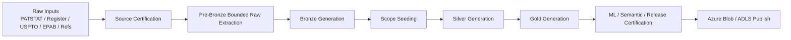

# PatentIQ ETL

Local one-time ETL, model, and semantic artifact build workspace for PatentIQ MVP.

## Purpose

This workspace builds:

1. Bronze source-preserving Parquet
2. Silver normalized analytical tables
3. Gold product marts
4. ML manifests and artifacts
5. semantic vector payloads and ANN assets
6. release manifests and Data Room metadata

## Operating Mode

This ETL is designed for:

1. local deterministic builds
2. bounded 10-field mega-cluster scope
3. one authoritative Azure artifact store as publish target
4. strong stage manifests and markdown operation logging

## Main Commands

```bash
python scripts/certify_sources.py
python scripts/run_stage.py prebronze
python scripts/run_stage.py bronze
python scripts/run_stage.py scope
python scripts/run_stage.py silver
python scripts/run_stage.py gold
python scripts/run_stage.py ml
python scripts/run_stage.py semantic
python scripts/run_stage.py certify-release
python scripts/publish_artifacts.py
```

## Source Modes

The current default ETL configuration is:

1. `PATSTAT` -> `TIP`
2. `PATSTAT Register` -> `TIP`
3. `EPAB` -> `TIP`
4. `USPTO` -> `local_files`
5. `refs` -> `local_files`

This means `prebronze` is the source-adapter stage:

1. TIP clients build bounded PATSTAT, Register, and EPAB extracts,
2. USPTO bulk XML files are filtered locally into the bounded raw layer,
3. Bronze, Silver, and Gold continue from parquet artifacts instead of live client queries.

## Tracking

All stage runs should update:

1. `etl/manifests/`
2. `etl/ETL_IMPLEMENTATION_LOG.md`

## ETL Flow

### High-Level Flow



### Technical Stage Flow

```mermaid
flowchart LR
    RCERT["scripts/certify_sources.py<br/>bronze/certify.py"]
    PRE["scripts/run_stage.py prebronze<br/>prebronze/extract.py"]
    BR["bronze/run.py<br/>ingest_structured / ingest_uspto / ingest_epab"]
    SC["silver/run.py scope<br/>build_scope_seed()"]
    SI["silver/run.py silver<br/>build_core_silver / build_enrichment_silver"]
    GO["gold/run.py<br/>build_gold()"]
    EX["ml/run.py + semantic/run.py + publish/run.py"]

    RR["etl/data/raw/*"] --> RCERT
    RCERT --> PRE
    PRE --> RB["etl/data/raw-bounded/*"]
    RB --> BR
    BR --> BO["etl/data/bronze/*"]
    BO --> SC
    SC --> SI
    SI --> SO["etl/data/silver/*"]
    SO --> GO
    GO --> GOUT["etl/data/gold/*"]
    GOUT --> EX
```



## Governing Docs

See:

1. [24-patentiq-v2-local-etl-and-artifact-build-runbook.md](/Users/ardaerkan/Documents/MIGRATE/patent-iq/docs/next-phase-v2/24-patentiq-v2-local-etl-and-artifact-build-runbook.md)
2. [14-patentiq-v2-metrics-generation-flow-and-guardrails.md](/Users/ardaerkan/Documents/MIGRATE/patent-iq/docs/next-phase-v2/14-patentiq-v2-metrics-generation-flow-and-guardrails.md)
3. [15-patentiq-v2-prediction-training-flow-and-guardrails.md](/Users/ardaerkan/Documents/MIGRATE/patent-iq/docs/next-phase-v2/15-patentiq-v2-prediction-training-flow-and-guardrails.md)
4. [16-patentiq-v2-semantic-search-and-comparison-flow-and-guardrails.md](/Users/ardaerkan/Documents/MIGRATE/patent-iq/docs/next-phase-v2/16-patentiq-v2-semantic-search-and-comparison-flow-and-guardrails.md)
5. [17-patentiq-v2-mega-cluster-scope-and-ghost-node-clarification.md](/Users/ardaerkan/Documents/MIGRATE/patent-iq/docs/next-phase-v2/17-patentiq-v2-mega-cluster-scope-and-ghost-node-clarification.md)
