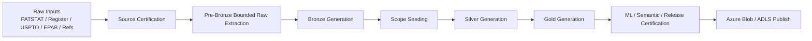

# PatentIQ ETL

Local one-time ETL, model, and semantic artifact build workspace for PatentIQ MVP.

## Purpose

This workspace builds:

1. Bronze source-preserving Parquet
2. Silver normalized analytical tables
3. Gold product marts
4. ML manifests and artifacts
5. semantic vector payloads and ANN assets
6. release manifests and Data Room metadata

## Operating Mode

This ETL is designed for:

1. local deterministic builds
2. bounded 10-field mega-cluster scope
3. one authoritative Azure artifact store as publish target
4. strong stage manifests and markdown operation logging

The current scope policy is:

1. main operating window: `2007-2026`
2. separate heritage backfill horizon: `1996-2006` for older mega-cluster families when historical influence requires it

## Main Commands

```bash
python scripts/certify_sources.py
python scripts/run_stage.py certify
python scripts/run_stage.py plan-tip-export
python scripts/run_stage.py plan-tip-heritage-export
python scripts/run_stage.py recover-tip-blob-uploads
python scripts/run_stage.py prebronze
python scripts/run_stage.py prebronze-heritage
python scripts/run_stage.py prebronze-uspto-odp
python scripts/run_stage.py bronze
python scripts/run_stage.py scope
python scripts/run_stage.py silver
python scripts/run_stage.py gold
python scripts/run_stage.py ml
python scripts/run_stage.py semantic
python scripts/run_stage.py certify-release
python scripts/publish_artifacts.py
```

## Source Modes

The current default ETL configuration is:

1. `PATSTAT` -> `TIP`
2. `PATSTAT Register` -> `TIP`
3. `EPAB` -> `TIP`
4. `USPTO` -> `odp_api`
5. `refs` -> `local_files`

This means `prebronze` is the source-adapter stage:

1. TIP clients build bounded PATSTAT, Register, and EPAB extracts,
2. USPTO is externalized by default through the local `odp_api` path rather than treated as a required TIP-local raw source,
3. when `tip_chunked_export_enabled = true`, `prebronze` executes field/year/table-family chunks instead of one monolithic bounded raw export,
4. Bronze, Silver, and Gold continue from parquet artifacts instead of live client queries,
5. the TIP seed stage respects the configured ETL year window rather than pulling the full historical field universe.

When `uspto_source_mode = "odp_api"`:

1. run `prebronze` for the PATSTAT/Register/EPAB seed path as usual,
2. then run `prebronze-uspto-odp` locally to turn bounded USPTO APPXML into direct Bronze parquet outputs,
3. then run `bronze`, which will reuse those existing USPTO Bronze artifacts instead of reparsing bounded XML,
4. generic TIP certification should no longer degrade just because local USPTO XML files are absent in that runtime.

## TIP Capacity Note

When this ETL is run inside TIP, assume roughly:

1. `4 CPU cores`
2. `32 GB RAM`
3. `30 GB local storage`

That is enough for:

1. source certification,
2. seed generation,
3. bounded chunk extraction,
4. small parallel chunk execution,
5. immediate upload to Blob.

It is not enough for:

1. one monolithic full-scope `prebronze` export,
2. keeping the whole bounded raw layer locally,
3. full downstream warehouse consolidation.

For the full 10-field scope, use the TIP chunked execution plan:

1. [28-patentiq-v2-tip-chunked-full-scope-execution-plan.md](/Users/ardaerkan/Documents/MIGRATE/patent-iq/docs/next-phase-v2/28-patentiq-v2-tip-chunked-full-scope-execution-plan.md)
2. [29-patentiq-v2-two-horizon-scope-and-heritage-backfill-policy.md](/Users/ardaerkan/Documents/MIGRATE/patent-iq/docs/next-phase-v2/29-patentiq-v2-two-horizon-scope-and-heritage-backfill-policy.md)

The current TIP executor now applies:

1. a bounded global chunk scheduler,
2. family-level concurrency caps from `execution.max_workers`,
3. Azure Blob upload tuning through:
   - `upload_max_concurrency`
   - `upload_max_block_size_mb`
   - `upload_max_single_put_size_mb`
4. live stage events in `etl/manifests/stages/pre-bronze-chunked-export.events.jsonl`
5. normal chunk manifests under `etl/manifests/chunks/`

Before chunk execution starts, the chunked TIP path now also:

1. materializes the global seed parquet set under `etl/data/raw-bounded/_seeds/`,
2. uploads those seed artifacts to `raw-bounded/seeds/`,
3. reuses the existing seed files on rerun when they already exist.

This does not change the existing chunk restart behavior:

1. chunks with a successful manifest are still skipped on rerun,
2. only unfinished or failed chunks are retried,
3. successful-but-not-uploaded chunks still require `recover-tip-blob-uploads`.

If a run produced successful local chunk outputs but missed Blob upload metadata, use:

```bash
python scripts/run_stage.py recover-tip-blob-uploads
```

That recovery stage:

1. scans successful chunk manifests with empty `uploaded_blobs` and failed chunk manifests that look like Blob/upload-timeout failures,
2. uploads any still-present local outputs to the deterministic chunk Blob prefixes,
3. updates the manifests and restores upload-failed chunks back to `success` when recovery completes,
4. cleans recovered temp directories when `cleanup_after_upload = true`.

## Tracking

All stage runs should update:

1. `etl/manifests/`
2. `etl/ETL_IMPLEMENTATION_LOG.md`

## ETL Flow

### High-Level Flow



### Technical Stage Flow

```mermaid
flowchart LR
    RCERT["scripts/certify_sources.py<br/>bronze/certify.py"]
    PRE["scripts/run_stage.py prebronze<br/>prebronze/extract.py"]
    BR["bronze/run.py<br/>ingest_structured / ingest_uspto / ingest_epab"]
    SC["silver/run.py scope<br/>build_scope_seed()"]
    SI["silver/run.py silver<br/>build_core_silver / build_enrichment_silver"]
    GO["gold/run.py<br/>build_gold()"]
    EX["ml/run.py + semantic/run.py + publish/run.py"]

    RR["etl/data/raw/*"] --> RCERT
    RCERT --> PRE
    PRE --> RB["etl/data/raw-bounded/*"]
    RB --> BR
    BR --> BO["etl/data/bronze/*"]
    BO --> SC
    SC --> SI
    SI --> SO["etl/data/silver/*"]
    SO --> GO
    GO --> GOUT["etl/data/gold/*"]
    GOUT --> EX
```



## Governing Docs

See:

1. [24-patentiq-v2-local-etl-and-artifact-build-runbook.md](/Users/ardaerkan/Documents/MIGRATE/patent-iq/docs/next-phase-v2/24-patentiq-v2-local-etl-and-artifact-build-runbook.md)
2. [uspto-odp-stream-extraction-pipeline.md](/Users/ardaerkan/Documents/MIGRATE/patent-iq/docs/data/uspto-odp-stream-extraction-pipeline.md)
3. [14-patentiq-v2-metrics-generation-flow-and-guardrails.md](/Users/ardaerkan/Documents/MIGRATE/patent-iq/docs/next-phase-v2/14-patentiq-v2-metrics-generation-flow-and-guardrails.md)
4. [15-patentiq-v2-prediction-training-flow-and-guardrails.md](/Users/ardaerkan/Documents/MIGRATE/patent-iq/docs/next-phase-v2/15-patentiq-v2-prediction-training-flow-and-guardrails.md)
5. [16-patentiq-v2-semantic-search-and-comparison-flow-and-guardrails.md](/Users/ardaerkan/Documents/MIGRATE/patent-iq/docs/next-phase-v2/16-patentiq-v2-semantic-search-and-comparison-flow-and-guardrails.md)
6. [17-patentiq-v2-mega-cluster-scope-and-ghost-node-clarification.md](/Users/ardaerkan/Documents/MIGRATE/patent-iq/docs/next-phase-v2/17-patentiq-v2-mega-cluster-scope-and-ghost-node-clarification.md)
